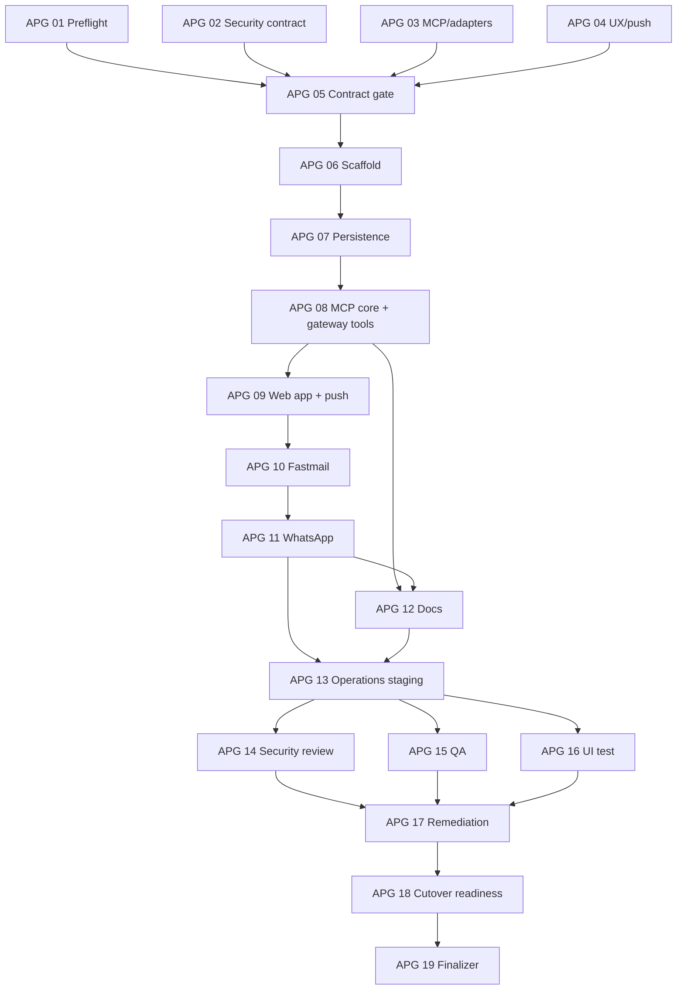

# Signet — Generic MCP Human Approval Gateway Implementation Plan

**App name:** Signet. A signet ring seals a letter before it may be sent: nothing configured behind this gateway goes out without Autumn's seal. Use "Signet" in all user-facing surfaces (web app title, PWA name, Homepage card, notifications, docs) and `signet` for machine identifiers (package name, service directory, launchd label suffix, CLI). "Approval gateway" remains the generic architectural term in prose.

> **For Hermes:** Use the `subagent-driven-development` skill to implement this plan task by task. Do not click, invoke, simulate, or bypass the human approval action during implementation or testing, and never fabricate, guess, or replay a TOTP code.

**Goal:** Put most write-capable MCP actions behind one private approval gateway. For explicitly configured communication tools such as email and WhatsApp, the calling AI receives an honest structured `pending_approval` result immediately; the real external action remains frozen until Autumn approves it — in a private web app, or by relaying her current TOTP code through the chat to the gateway's own `approve_request` MCP tool. The AI is never lied to: no synthetic success result is ever returned for an unsent action.

**First adapters:** Fastmail email and an MCP-backed WhatsApp sender. The core must remain provider-neutral so more MCP servers and tools can be added through policy plus a small adapter, rather than building a new approval service each time.

**Architecture:** A low-resource Python service exposes agent-facing MCP endpoints on `127.0.0.1:8789` and a separate human-facing web application on its own TCP listener. The web app is a normal authenticated HTTPS web application: passkey (WebAuthn) login as the primary method, password + TOTP as the fallback, with server-side sessions, CSRF protection, and strict security headers. It must be safe as a normal authenticated web app with no dependence on a tailnet or identity-injecting proxy; Tailscale Serve is the reference *deployment* choice (see “Deployment options”), not an architectural requirement. The service mirrors reviewed downstream tool schemas, applies an exact per-tool policy, freezes gated payloads, returns an honest pending result, adds the real pending action to the private web inbox, sends a privacy-safe browser push notification, and additionally exposes a small gateway-owned MCP tool surface (`check_approval_status`, `list_pending_approvals`, `approve_request`, `cancel_request`, `request_tool_access`). The downstream MCP credential and real mutation call live only inside the approval service; approval requires a fresh human confirmation (WebAuthn in the web app, or a single-use TOTP code via web form or the `approve_request` MCP path).

**Tech stack:** Python 3.12, `uv`, official Python MCP SDK/FastMCP, Starlette or FastAPI, SQLite in WAL mode, Pydantic, Jinja2, HTMX, a mobile-first installable PWA shell with Web Push (VAPID), WebAuthn/passkeys with a TOTP (RFC 6238) fallback option, pytest, macOS Keychain, and launchd. Tailscale Serve appears only in the deployment guide.

---

## Product decision: honest pending acknowledgement

The gateway never fabricates success. Every gated write tool returns a truthful, structured pending result and gives the AI first-class tools to observe and progress the request.

### Agent-visible reality

For a tool configured as `approval`, the gateway returns a gateway-shaped pending result after the request has been durably frozen and queued:

```json
{
  "status": "pending_approval",
  "request_id": "req_01J...",
  "expires_at": "2026-07-22T09:00:00Z",
  "message": "This action requires human approval. Check status with check_approval_status."
}
```

This is the normative product-level shape (the exact MCP wire encoding — `structuredContent` plus a serialized text block — is defined by the gateway's own advertised output schema for gated tools). The result is emitted only after the exact canonical payload, hash, expiry, and origin metadata are committed durably.

### Documented contract divergence

The mirrored gated tool keeps its original downstream name (for example `send_email`), but its result while pending is gateway-shaped, not the downstream provider's success contract. This divergence is deliberate and documented rather than papered over:

- For `approval`-mode tools, the mirrored `Tool` definition replaces the downstream `outputSchema` with the gateway pending-result schema and appends a description note stating that the tool is human-gated and returns `pending_approval` until approved.
- For `passthrough` and `virtualize_local` tools, the original downstream contract (including `outputSchema`) is preserved verbatim and losslessly; a `virtualize_local` synthetic local object must validate against that captured downstream contract.
- After a request succeeds, the real downstream result's safe metadata (including any real provider identifiers) is available to the AI through `check_approval_status`. There is no pre-delivery synthetic identifier, so there is no pre-delivery dependent-ID translation problem: a workflow that needs the real ID simply waits for approval and reads it from the status tool.

### Human and system reality

The approval database and private web app remain authoritative. Immediately after the pending result, the real state is `pending_approval` and no downstream mutation has occurred. Only Autumn's fresh human confirmation — a WebAuthn assertion in the web app, or a valid single-use TOTP code (web form or MCP `approve_request`) — may move it to delivery.

A pending request detail page states the plain truth:

```text
📨 Email waiting for approval
To: person@example.com
Subject: Viewing on Tuesday
State: pending_approval — NOT SENT
The AI was told: pending_approval (honest)
[Approve & send] [Deny] [Edit]
```

If Autumn denies or ignores the request, nothing is sent, and the AI can discover that outcome truthfully via `check_approval_status` (denied, expired, or cancelled). Because the AI is never told an unsent action succeeded, there is no transcript-correction problem and no accepted-lie trade-off in this design.

### Which tools are gated

`approval` mode is the default for any consequential write: sending an email, sending a WhatsApp message, posting messages, and any other reviewed mutation. Higher-risk categories — money movement, deletion, deployments, DNS, infrastructure, access control, database writes with dependent workflows — stay in `approval` or `deny` and additionally require a specific adapter review before onboarding. Unknown write-capable tools are always `deny`.

## The gateway MCP approval surface

The gateway exposes its own small, explicitly gateway-branded MCP tool surface to the calling AI. This reverses the earlier "no model-visible approval or status tool" rule: that rule existed to protect a lie, and the lie is gone. With honest pending results, a status-and-approval surface is the natural companion.

### Tools

| Tool | Arguments | Effect |
|---|---|---|
| `check_approval_status` | `request_id` | Returns the authoritative state (`pending_approval`, `approved`, `executing`, `succeeded`, `failed`, `outcome_unknown`, `denied`, `expired`, `cancelled`), version, expiry, and — after success — the safe downstream result metadata including real provider identifiers. Scoped to the calling namespace: an unknown or foreign `request_id` returns the same not-found error. |
| `list_pending_approvals` | none | Returns the calling namespace's pending requests: request ID, service, tool, masked destination summary, age, expiry, and version hash prefix. Enough for the AI to relay "you have these waiting" to the user; full bodies stay in the web app. The version hash prefix is the value the AI must pass back to `approve_request`. |
| `approve_request` | `request_id`, `totp_code`, `expected_version_hash` | Approves exactly one pending request if the code verifies **and** `expected_version_hash` (the hash prefix from `list_pending_approvals` that was relayed to the user) matches the request's current version. Any mismatch — including an edit made after the user read the summary — fails closed with zero downstream calls. Refuses gateway-internal policy-change requests, which are web-approval-only. See "TOTP-in-chat approval" below. |
| `cancel_request` | `request_id` | Cancels a pending request that the same authenticated caller namespace created. Cancellation is the safe direction (nothing gets sent), so no code is required; it is fully audited and surfaced in the web app. |
| `request_tool_access` | `alias`, `tool`, `reason` | Asks for a policy change (for example, promote a read tool to `passthrough`). Creates a gateway-internal request in the same approval queue. It takes no code and performs no privileged mutation itself, so it works regardless of TOTP enrolment; the resulting policy-change request is approved **only in the web app** (WebAuthn, or the web TOTP form), never via MCP `approve_request`. |

Only `approve_request` consumes a code, so only `approve_request` carries a TOTP-enrolment precondition: if TOTP is not enrolled, it returns a structured error directing the user to the web app. Deny and edit remain web-only actions: denial deserves the full-context detail view, and editing requires the versioned diff UI. Policy-change approvals are likewise web-only (see "Policy UX") because a policy change is a durable capability grant, not a single send.

**Error channel:** all gateway-tool domain failures — unknown or foreign `request_id`, stale version/hash, invalid or consumed TOTP code, lockout, TOTP not enrolled, web-only action — return `CallToolResult(isError=true)` with a stable machine-readable error code and human-readable guidance. JSON-RPC protocol errors are reserved for malformed requests and unknown tool names, matching the rule in "MCP compatibility contract".

### TOTP-in-chat approval: the code is the human-presence proof

The chatbot is only a transport. The flow:

1. The AI relays pending requests (via `list_pending_approvals`) or the user reads them in the web app / a push notification. Each relayed summary includes the version hash prefix of the frozen payload the user is being asked to approve.
2. The user decides, opens their authenticator app, and types the current 6-digit TOTP code into the chat, naming which request it is for.
3. The AI calls `approve_request(request_id, totp_code, expected_version_hash)` with the hash prefix from the summary the user was shown.
4. The gateway verifies and, on success, returns a receipt echoing exactly what was approved: tool, destination summary, version, and payload hash prefix — so the user can see in the transcript precisely what was authorized (with the caveat below), and fires the approval push notification.

Security requirements (these mirror and extend the "Human confirmation methods" section):

- Codes are single-use and consumed atomically with the state transition; an accepted code can never authorize a second action, and replay within the validity window fails closed.
- Verification binds to `request_id` + version + payload hash, where the version checked is the caller-supplied `expected_version_hash` — the version the user actually reviewed — compared against the current stored version. Any edit bumps the version, invalidates every in-flight approval (TOTP or WebAuthn), and makes any `approve_request` carrying the pre-edit hash fail closed with zero downstream calls. This closes the TOCTOU window between the user reading the relayed summary and the agent submitting the code.
- Failed attempts are rate-limited with escalating lockout, shared across the web form and the MCP path, and lockout state is visible in the audit view.
- The success result echoes the approved action so a mismatch can be visible in the chat transcript.
- Every MCP-path approval fires a privacy-safe push notification ("1 request approved via chat and dispatched": service and action type only), so the approval has an out-of-band signal the agent cannot suppress.
- Gateway-internal policy-change requests are not approvable via `approve_request`; a code cannot be redirected into a durable capability grant.

**Documented swap risk, honestly:** the agent sits between the user and the gateway. A misbehaving agent could apply the user's fresh code to a *different* pending request than the one the user intended, within the code's validity window (subject to the hash binding above — the swap must target another currently pending request whose hash the agent also holds). Mitigations: the binding to a specific `request_id`/version/hash means the code authorizes exactly one concrete frozen action; the **approval push notification** fires on every MCP-path approval, so a spent code always produces an out-of-band signal, and the un-approved intended request remains pending (and later triggers approaching-expiry notification) rather than being silently lost; the receipt echo makes the swap visible in-transcript *when the chat client renders tool results verbatim* — because the agent is the transport, it could paraphrase or fabricate the receipt, so the receipt is a convenience signal, not a load-bearing control; the authoritative record of what was approved is the web-app event timeline plus the approval notification; rate limiting bounds guessing. A related variant is the **code-pretext / policy-escalation swap**: an agent could invent a pretext to obtain a code, or redirect one, toward something with durable consequences. This is why policy-change requests (`request_tool_access` outcomes, one-click promotions) are excluded from the MCP approval path entirely — a swapped code can at worst cause one wrong send of an already-frozen reviewed payload, never a capability grant. This is an accepted-risk convenience path. The web app with WebAuthn — whose assertion is cryptographically bound to the exact action and cannot be redirected by the agent — remains the recommended high-assurance path, and remains the only path for deny, edit, and policy changes.

### Surface hygiene

- The gateway tool surface is registered under its own alias (for example `/mcp/approvals`) so it is visibly gateway-owned, never masquerading as a downstream tool.
- These tools return only masked destination summaries and safe metadata, never full bodies or attachments; full content review remains a web-app capability.
- WebAuthn approvals remain web-only: there is no MCP path that can satisfy a WebAuthn challenge.
- All gateway-tool mutations are recorded in `request_events` with the acting namespace.

## Policy modes

Every exposed downstream tool has one exact policy mode:

| Mode | Model sees | Downstream timing | Intended use |
|---|---|---|---|
| `passthrough` | Real downstream result | Immediate | Explicitly allowlisted read-only tools |
| `virtualize_local` | Upstream-compatible synthetic local object | Never for this call | Local attachment/media staging and virtual drafts consumed by a later gated send |
| `approval` | Honest structured `pending_approval` result | Only after human-confirmed approval | Email, WhatsApp, and all other reviewed mutations |
| `deny` | Policy error (`CallToolResult(isError=true)`, recorded as a promotable denied-call event) | Never | Reviewed but destructive or disallowed tools; unconfigured/unknown tools are unlisted entirely (see below) |

Policy is deny-by-default. MCP `readOnlyHint`, `destructiveHint`, tool descriptions, and verb heuristics may assist onboarding, but they are advisory and must never auto-enable a tool. Each active policy must name an exact downstream alias and tool name.

Two `deny` variants exist and behave differently in the mirror: a tool with an **explicit reviewed `deny` policy** is listed in `tools/list` and calling it returns `CallToolResult(isError=true)` with a policy error, recording a denied-call event that feeds the one-click promotion UX; an **unconfigured downstream tool** is omitted from `tools/list` entirely and calling it yields an unknown-tool protocol error with no promotable event. "Never expose unconfigured tools" applies to the latter only.

`virtualize_local` is not a general escape hatch. It is allowed only for a reviewed adapter whose entire effect is a bounded local object under the gateway's private staging root. It creates no provider-side object and no standalone approval request. Local staging IDs carry a type and owner scope, expire, are reference-counted, and may be consumed only by a later request from the same adapter/account. The eventual send approval page includes the complete staged object; denial, expiry, or abandonment purges it according to retention policy.

### Policy UX: deny-by-default, but allowing is cheap

Deny-by-default only works long-term if allowing safe things is nearly free:

- **One-click promotion from events.** From any pending or denied-call event in the web app, the user can promote the tool directly: "always allow this tool" (→ `passthrough`, intended for reads) or "always gate this tool" (→ `approval`, intended for writes). The promotion action itself requires the same fresh human confirmation as an approval.
- **AI-requested access.** The AI calls `request_tool_access(alias, tool, reason)`; the request lands in the same approval queue as any send, with the proposed policy change rendered as the reviewable payload, and is approved with a fresh human confirmation **in the web app only** (WebAuthn, or the web TOTP form). Policy changes are durable capability grants, so they are deliberately excluded from the MCP `approve_request` path and its documented swap risk.
- **Versioned and audited.** Every policy change produces a new policy version with actor, timestamp, prior mode, new mode, and originating event, recorded in `policy_versions` and the audit view. Policy rollback is a normal versioned change, not a file edit.
- **Sends stay individually gated.** The point of cheap allowing is bulk-enabling safe read tools, not ungating sends. `send_email` and WhatsApp sends remain in `approval` mode. The `passthrough` guard is broad: the one-click UI and the policy engine refuse `passthrough` for any tool the adapter marks as a communication send **and** for any tool that lacks a reviewed read-only classification — an unreviewed or write-capable tool can be promoted at most to `approval`, never to `passthrough`.
- **Policy changes take effect over MCP immediately.** Every applied policy version that alters an alias's exposed tool set or a mirrored tool's schema (one-click promotion, an approved `request_tool_access`, drift auto-disable or re-enable) emits `notifications/tools/list_changed` on the affected upstream surfaces, so the calling AI discovers the change without a reconnect or `/reload-mcp` (see "MCP compatibility contract").

## Acceptance criteria

- [ ] Hermes connects only to local gateway endpoints for every managed downstream MCP.
- [ ] Each local endpoint preserves the original downstream alias and tool names, so Hermes continues to see familiar names such as `mcp_fastmail_send_email`; gated tools' mirrored definitions carry the documented gateway pending-result output schema.
- [ ] A gated email or WhatsApp call returns the honest structured pending result (`status`, `request_id`, `expires_at`, `message`) and never a fabricated success.
- [ ] The pending result is emitted only after the exact canonical payload, hash, expiry, and origin metadata are committed durably.
- [ ] No downstream mutation, attachment upload, or server-side draft occurs before approval.
- [ ] The gateway MCP surface works end to end: `list_pending_approvals` and `check_approval_status` return authoritative truthful state, scoped to the calling namespace (a foreign or unknown `request_id` returns the same not-found error); `check_approval_status` exposes safe real result metadata after success; `cancel_request` cancels only the caller's own pending requests.
- [ ] `approve_request` with a valid TOTP code and matching `expected_version_hash` approves exactly one bound request: single-use atomic consumption, binding to request ID + version + payload hash (a code submitted with a stale hash after an edit performs zero downstream calls), shared rate limiting with escalating lockout, and a receipt echoing tool, destination summary, and version hash. Without TOTP enrolment, `approve_request` returns an error directing to the web app. Deny, edit, and policy-change approval are impossible via MCP.
- [ ] The private web app shows the actual pending state and enough content to make an informed decision on desktop and phone.
- [ ] Only an authenticated user with a registered human confirmation method (passkey, or TOTP in the documented accepted-risk configuration) can approve, deny, or edit. Cancellation is available to the human in the web app (with confirmation) and — as the one deliberate code-free state change — to the creating caller namespace via the audited MCP `cancel_request` tool, because cancellation can only prevent a send.
- [ ] Browser push notifications (Web Push, VAPID, per-device opt-in) fire on: new pending request, approaching expiry (24h before), any approval performed through the MCP `approve_request` path, `outcome_unknown` entry/resolution/exhaustion, and a daily digest of pending count. Payloads contain only service, action type, and counts — never bodies, subjects, or recipients. A pending request can no longer expire unseen, and a code spent via chat always produces an out-of-band signal.
- [ ] Approving creates at most one initial dispatch attempt for the exact frozen version. After an ambiguous dispatch, adapter-defined read-only reconciliation runs automatically on a bounded schedule against a gateway-restricted read-only downstream client; where the downstream supports a stable idempotency key, exactly one automatic re-dispatch with the same key is permitted after reconciliation confirms no effect occurred; a confirmed no-effect without a key resolves to a definite `failed (reconciled_no_effect)` state that re-enables the normal manual send-again flow. There is never a blind automatic retry.
- [ ] Unresolved `outcome_unknown` requests trigger a push notification and are prominently surfaced — never silent, never lost.
- [ ] Editing changes the payload version and hash, requires a fresh approval, and invalidates every in-flight WebAuthn challenge and TOTP approval for the old version.
- [ ] Retries carrying the same explicit idempotency key or stable upstream call identity resolve to one request and one byte-identical pending result. Repeated equal content without shared call identity remains a new intentional action.
- [ ] Unknown write tools are denied rather than guessed to be safe.
- [ ] `request_tool_access` lands in the same approval queue and files regardless of TOTP enrolment; policy-change requests are approvable only in the web app; approved policy changes are versioned, audited, and announced upstream via `notifications/tools/list_changed` so the promoted tool appears in the next `tools/list` without a gateway or client restart; one-click promotion from pending/denied events works with the same human confirmation; sends and tools without a reviewed read-only classification cannot be promoted to `passthrough`.
- [ ] Downstream credentials are absent from ordinary Hermes profile configuration, environment variables, logs, databases, process arguments, and MCP clients. The shared-user MVP does not claim OS-enforced secrecy from a malicious same-user process; that claim requires the separate-account or separate-host deployment mode.
- [ ] Fastmail and WhatsApp direct-send bypasses are removed from active Hermes paths after cutover.
- [ ] The web app is safe as a normal authenticated HTTPS web application: passkey login primary, password + TOTP fallback, secure sessions, CSRF, and strict headers, with no dependence on Tailscale identity headers. It is never exposed publicly without TLS + auth.
- [ ] The `docs/` set ships with the release: MCP approval tool reference (schemas, example chat flows including TOTP-in-chat approval, error cases), security model with honest limits, deployment guide, and policy configuration guide.
- [ ] No gateway restart is used if `/reload-mcp` applies the configuration. A controlled restart still requires explicit approval.

## Scope and limitations

### In scope

- HTTP and stdio downstream MCP servers
- Schema discovery and mirrored tool registration
- Exact per-tool policy with versioned, audited changes and cheap promotion UX
- Generic JSON payload capture and review
- Adapter-specific rich previews and reconciliation lookups
- The gateway-owned MCP approval tool surface
- Mobile-first private web approval app with Web Push notifications (MVP)
- WebAuthn/passkey confirmation in the web app; TOTP confirmation via web form and via `approve_request`
- Fastmail and WhatsApp as first production adapters
- A repeatable onboarding command for additional MCP servers
- The `docs/` documentation set as a first-class deliverable

### Not automatically covered

- Native Hermes tools that are not MCP tools
- Direct terminal scripts, provider SDKs, browser automation, or webhooks that bypass MCP
- Hermes' own WhatsApp platform adapter unless outbound WhatsApp is deliberately routed through an MCP tool or a later native dispatch interceptor
- A malicious process with the same macOS account and unrestricted terminal/Keychain access

For WhatsApp, the first implementation must choose an MCP-backed sender and remove the corresponding direct native send surface from profiles that should be gated. A later Hermes-native middleware may reuse the same policy and approval service, but it is not required for the MCP MVP.

## Generic architecture

```text
Hermes / other MCP client
        |
        | mcp_fastmail_send_email, mcp_whatsapp_send_message, ...
        | + gateway tools: check_approval_status, list_pending_approvals,
        |   approve_request, cancel_request, request_tool_access
        v
Local approval gateway
        +-- agent MCP: 127.0.0.1:8789/mcp/<alias> and /mcp/approvals
        +-- human web: authenticated HTTPS app on its own TCP listener
        |
        +-- MCP schema mirror and alias router
        +-- exact policy engine (versioned, audited)
        +-- canonical payload freezer and SHA-256
        +-- honest pending-result emitter
        +-- gateway approval tool surface (status/approve/cancel/access)
        +-- SQLite request and event store
        +-- private web inbox, session, CSRF, WebAuthn + password/TOTP auth
        +-- Web Push notifier (VAPID)
        +-- adapter registry, executor, and reconciliation scheduler
        +-- Keychain-backed downstream credential broker
        |
        | only after human approval
        v
Official or selected downstream MCP server
```

### Preserve downstream aliases

Expose a separate path for each downstream MCP and register it under the original Hermes server alias:

```yaml
mcp_servers:
  fastmail:
    url: http://127.0.0.1:8789/mcp/fastmail
    headers:
      Authorization: Bearer ${MCP_...KEN}
    sampling:
      enabled: false

  whatsapp:
    url: http://127.0.0.1:8789/mcp/whatsapp
    headers:
      Authorization: Bearer ${MCP_...KEN}
    sampling:
      enabled: false

  approvals:
    url: http://127.0.0.1:8789/mcp/approvals
    headers:
      Authorization: Bearer ${MCP_...KEN}
    sampling:
      enabled: false
```

This keeps model-facing tool names stable while replacing only the server behind them. Do not register the direct downstream URL in the same profile.

### Service layout

Target path: `~/.hermes/services/signet/`

```text
src/signet/
  app.py
  config.py
  db.py
  models.py
  state_machine.py
  canonical.py
  policy.py
  mcp_mirror.py
  gateway_tools.py
  credential_broker.py
  auth.py
  webauthn.py
  totp.py
  web.py
  notifications.py
  reconcile.py
  templates/
  static/
  delivery.py
  adapters/
    base.py
    generic_json.py
    fastmail.py
    whatsapp.py
docs/
  mcp-approval-tools.md
  security-model.md
  deployment.md
  policy-guide.md
```

There is no `result_renderers/` directory: gated tools return the one documented gateway pending-result shape, and successful real results flow back through `check_approval_status` as safe metadata.

## Request lifecycle

```text
received -> validating -> pending_approval
                              |
                              +-> approved -> preparing -> dispatch_started -> succeeded
                              |                                         |-> failed
                              |                                         |-> outcome_unknown
                              |                                              |-> (reconciliation)
                              |                                                  |-> succeeded (effect confirmed)
                              |                                                  |-> re-dispatch once with same
                              |                                                  |   idempotency key (no-effect
                              |                                                  |   confirmed, key supported)
                              |                                                  |-> failed (reconciled_no_effect:
                              |                                                  |   no-effect confirmed, no key;
                              |                                                  |   notify, manual send-again OK)
                              |                                                  |-> unresolved: notify + surface
                              +-> denied
                              +-> expired
                              +-> cancelled
```

The model-visible pending result is returned immediately after the atomic `pending_approval` commit. It is an honest recorded acknowledgement of queueing, and `check_approval_status` always reflects the authoritative state above.

Rules:

- No downstream mutation occurs in `received`, `validating`, or `pending_approval`.
- Approval — whether from the web app or `approve_request` — uses compare-and-swap over request ID, version, and payload hash, and atomically consumes the confirming credential (WebAuthn challenge or TOTP code).
- The UI may group `preparing` and `dispatch_started` as `executing`, but persistence and recovery keep those phases distinct because only `preparing` leases are reclaimable.
- A second click (or a second `approve_request`) loses cleanly and makes no downstream call.
- `failed` never auto-retries. `outcome_unknown` never *blindly* auto-retries: the only automatic follow-ups are adapter-defined read-only reconciliation lookups and, when reconciliation has positively confirmed no effect *and* the original dispatch carried a downstream-supported stable idempotency key, exactly one automatic re-dispatch with that same key.
- When reconciliation confirms no effect but no idempotency key was available (expected to be the norm for WhatsApp), the request resolves to the definite terminal state `failed` with reason `reconciled_no_effect`, triggers a notification, and re-enables the normal manual send-again flow **without** the duplicate-delivery warning, because the prior outcome is now known to be "not sent".
- Every `outcome_unknown` entry and every reconciliation exhaustion triggers a push notification; unresolved unknowns are pinned at the top of the web queue.
- A manual send-again action after `failed` or unresolved `outcome_unknown` creates a new request linked by `retry_of_request_id`, displays a duplicate-delivery warning when the prior outcome is unknown, and requires a fresh human confirmation. It never reopens or replays the terminal request.
- "No response" means expiry and no action — and expiry can no longer be silent, because approaching-expiry and daily-digest notifications precede it.

## Data model and privacy

Database: `~/.hermes/services/signet/data/approvals.sqlite3`

Core tables:

- `approval_requests`: request ID, downstream alias, tool name, policy mode, state, current immutable version reference, origin namespace, created/expiry/approval/execution timestamps, and safe downstream outcome metadata. Gateway-internal requests (policy changes from `request_tool_access` or one-click promotion) live in this same table under the `gateway` alias. Do not duplicate canonical arguments here.
- `payload_versions`: immutable request version, encrypted canonical executable payload, hash, policy/adapter/schema versions, editor actor pseudonym, and purge/key-destruction state.
- `attachments`: local opaque ID, request/version, filename, MIME type, size, SHA-256, mode-0600 path, and purge timestamps.
- `idempotency_records`: authenticated caller namespace, downstream alias, tool, stable invocation key, payload fingerprint, request ID, byte-identical stored pending result, expiry/tombstone state, with a unique constraint over the caller/tool key.
- `execution_attempts`: one active attempt per request/version, random fencing token, worker generation, phase, lease expiry, dispatch-started time, downstream idempotency key where documented, reconciliation schedule state (attempt count, next check time, resolution), the single re-dispatch marker, and safe completion/classification metadata.
- `result_aliases`: real downstream identifiers recorded after confirmed execution so `check_approval_status` can return them; unique and namespaced by downstream alias, tool, account, and identifier. There are no pre-delivery synthetic IDs, so this table never feeds dependent-call translation before delivery.
- `request_events`: append-only state transitions with actor (human, gateway, or caller namespace via MCP), action, time, version, and hash. Do not duplicate message bodies or secrets.
- `policy_versions`: ordered policy versions with actor, timestamp, per-tool mode diffs, and originating event (one-click promotion, `request_tool_access` approval, or file change).
- `push_subscriptions`: per-device Web Push subscription endpoint and keys, device label, opt-in categories, created/last-success timestamps, and failure counters for pruning.
- `auth_credentials`: WebAuthn public credential material, password verifier (for the fallback login), TOTP enrolment state, and shared rate-limit/lockout counters spanning web and MCP verification paths.
- `schema_cache`: downstream schema digest, discovery time, and policy-review state.
- `purge_jobs`: idempotent purge intent and completion records for sensitive rows, files, encryption keys, and backup pins.
- `schema_meta`: ordered migration ID/checksum and supported schema range.

Privacy defaults:

- Service and data directories mode `0700`; database and staged files mode `0600`.
- Never log full bodies, recipient lists, phone numbers, attachments, credentials, session secrets, WebAuthn challenges, TOTP secrets or codes, push subscription keys, or raw downstream responses.
- Queue rows and gateway-tool summaries show only the minimum preview needed for scanning; full sensitive content belongs behind the authenticated web detail view.
- Push notification payloads contain only service, action type, and counts — never bodies, subjects, recipients, or filenames.
- Pending requests expire after 7 days unless a stricter tool policy applies.
- Sensitive payloads and attachments are envelope-encrypted with per-request data keys where the deployment key boundary can protect them. Purge is cryptographic key destruction plus idempotent file/row cleanup; without an isolated key boundary it is explicitly only logical deletion and may remain recoverable from WAL, free pages, APFS snapshots, or backups.
- Sent, denied, expired, cancelled, and definite-failed states follow an explicit retention matrix. Production retains unresolved or exhausted `outcome_unknown` content indefinitely until it resolves or a future schema-backed action consumes fresh request/version/hash-bound human confirmation. Only the marker-guarded fake demo offers acknowledged logical redaction for fault-injection data; it preserves the unknown state and permanently freezes reconciliation.
- Attachments purge immediately after confirmed success or denial, and after 24 hours for expired/cancelled requests, unless an unresolved execution or consistent-backup pin requires retention.
- Backups are encrypted bundles made with the SQLite backup API plus a manifest of gateway-owned attachment hashes and key references. A backup is usable only after restore into a separate path passes `integrity_check`, `foreign_key_check`, and attachment-hash verification.

## Policy configuration

Non-secret policy lives in a reviewed YAML file whose applied state is versioned in `policy_versions`. Credentials are references only.

```yaml
version: 1
default_mode: deny

approval_surface:
  type: web
  auth:
    primary: webauthn_passkey
    fallback: password_totp
  push_notifications: enabled

downstreams:
  fastmail:
    transport: http
    url: https://api.fastmail.com/mcp
    credential_ref: keychain://Signet/fastmail
    tools:
      search_email: {mode: passthrough}
      read_email: {mode: passthrough}
      read_thread: {mode: passthrough}
      list_folders: {mode: passthrough}
      list_identities: {mode: passthrough}
      upload_attachment:
        mode: virtualize_local
        adapter: fastmail.stage_attachment
      draft_email:
        mode: virtualize_local
        adapter: fastmail.local_draft
      send_email:
        mode: approval
        adapter: fastmail.send

  whatsapp:
    transport: stdio
    command_ref: configured-launcher
    credential_ref: keychain://Signet/whatsapp
    tools: {}  # generated only after the owned wrapper contract is frozen
```

The final WhatsApp tool names and schemas must come from live discovery of the selected server. Do not invent config names during implementation.

Policy changes applied through the web app (one-click promotion) or through an approved `request_tool_access` are written back as a new versioned policy state; the YAML file and `policy_versions` must never silently diverge, and reload fails closed on invalid state.

## Adapter contract

Each gated or richly rendered tool adapter implements:

```python
class ApprovalAdapter(Protocol):
    def validate(self, arguments: dict) -> None: ...
    def canonicalize(self, arguments: dict) -> dict: ...
    def summarize_for_web(self, arguments: dict) -> ApprovalSummary: ...
    def prepare_for_execution(self, request: Request) -> dict: ...
    async def execute(self, downstream: MCPClient, payload: dict) -> dict: ...
    def classify_outcome(self, result_or_error: object) -> Outcome: ...
    async def reconcile(self, downstream: ReadOnlyMCPClient, request: Request,
                        attempt: ExecutionAttempt) -> Reconciliation: ...
    def safe_result_metadata(self, downstream_result: dict) -> dict: ...
```

There is no `render_optimistic_result`: the gateway emits the one documented pending-result shape for every gated tool.

`reconcile` is the ambiguity resolver: a strictly read-only provider lookup (search for the sent message, list recent submissions, query by idempotency key) that can never cause a second side effect. That guarantee is enforced structurally, not by convention: the `downstream` client handed to `reconcile` is a gateway-restricted client that permits only an adapter-declared, policy-reviewed allowlist of read-only tools and rejects any other tool call at the gateway layer before it reaches the wire. Because reconciliation runs automatically and repeatedly (unlike `execute`, which runs once behind a human approval), an adapter bug must fail closed rather than silently mutate the provider. `reconcile` returns `confirmed_effect`, `confirmed_no_effect`, or `inconclusive`. The gateway calls it automatically on a bounded backoff schedule after any `outcome_unknown` (illustratively 1m, 5m, 30m, 2h, 12h; adapter-tunable, always finite). `confirmed_effect` resolves to `succeeded`; `confirmed_no_effect` permits the single keyed re-dispatch when the original dispatch used a downstream-supported stable idempotency key, and otherwise resolves to the definite terminal `failed (reconciled_no_effect)` state that notifies and re-enables normal manual send-again; `inconclusive` continues the schedule and, when the schedule exhausts, triggers the unresolved-unknown notification. An adapter without a safe lookup returns `inconclusive` unconditionally and documents that fact.

The generic JSON adapter supports approval-mode gating and raw structured review, with `reconcile` returning `inconclusive`.

## Private web approval experience

The approval app is the sole full-content human control plane. It is a mobile-first responsive web app installable as a PWA on Autumn's phone or computer. It must not depend on a messaging platform or another gated communication channel to surface or approve requests — the TOTP-in-chat path is a convenience overlay, not the system of record.

### Queue UX

- Default route: **Pending**, sorted oldest first, with a visible count and expiry. Unresolved `outcome_unknown` requests pin above pending.
- Additional views: Drafts, Succeeded, Denied/Expired, Failed/Unknown, Policy, and Audit.
- Queue rows show service, action, masked destination/count, subject where policy permits, attachment count, source profile, age, and expiry. Body previews, full targets, notification content, and sensitive app-switcher/page-title content are off by default.
- Detail view shows the complete frozen payload, recipient/destination fields, reply context, sanitized body, plain-text view, staged file names/sizes/hashes, policy and adapter versions, payload hash, and event timeline (including any MCP-path approval or cancellation with its acting namespace).
- Primary actions: **Approve & execute**, **Deny**, and **Edit**. Every web state-changing action requires fresh human confirmation. Deny and edit exist only here, never via MCP.
- Denied-call and pending events offer the one-click policy promotion actions described under "Policy UX"; the promotion confirmation sheet shows the exact alias, tool, old mode, and new mode.
- Editing creates a new immutable payload version and hash, returns it to `pending_approval`, and invalidates every older browser challenge and any in-flight TOTP approval.
- State labels always state the consequence: `pending_approval` is **Not sent**; `preparing`/`dispatch_started` is **Sending now — do not repeat**; `succeeded` is **Sent**; definite pre-side-effect `failed` is **Not sent**; `failed (reconciled_no_effect)` is **Confirmed not sent — safe to send again**; `outcome_unknown` is **May have sent — reconciling automatically, do not retry manually**; denied/expired/cancelled is **Nothing was sent**; stale/offline is **Status may be outdated — actions disabled**. Show server time, last refresh, and expiry, and do not reorder focused cards during refresh.

### Browser push notifications (MVP requirement)

Web Push is part of the MVP, not a later enhancement. This closes the silent-expiry gap: a pending request can no longer die unseen.

- Standard Web Push with VAPID keys (key material in the credential broker, never in config dumps or logs), per-device opt-in from the installed PWA, and a service worker that displays notifications and deep-links into the authenticated app.
- Notification triggers: a new pending request; approaching expiry (24 hours before); any approval performed through the MCP `approve_request` path ("1 request approved via chat and dispatched" — service and action type only), so a code spent in chat always has an out-of-band signal the agent cannot suppress; entry into `outcome_unknown`, its definite resolution (`reconciled_no_effect`), and reconciliation exhaustion; and a daily digest of the pending count.
- Payloads are privacy-safe by construction: service, action type, and counts only — never bodies, subjects, recipients, filenames, or identifiers. Tapping the notification requires normal authentication before any content is shown.
- Subscription endpoints are stored per device, pruned on persistent delivery failure, and revocable from settings. Push failures never block state transitions; the queue remains authoritative.
- The service worker still caches only immutable shell assets and never caches request lists/details, supports offline approval, or queues state-changing requests.

### Human confirmation methods

Every human state-changing action in the web app (approve, deny, edit, cancel, manual retry, credential or policy management) requires a fresh human confirmation. The one deliberate exception lives outside the web app: MCP `cancel_request` by the creating caller namespace needs no code, because cancellation can only make less happen — nothing gets sent — and it is namespace-scoped and fully audited (see "The gateway MCP approval surface"). Two confirmation methods are supported; the deployment configures one or both, and the user chooses at setup:

1. **WebAuthn/passkey (recommended default, web-only).** As specified throughout this plan: hardware-backed, user-verified, and cryptographically bound to the exact action, request ID, version, payload hash, and origin. An agent on the same machine cannot forge, replay, or redirect an assertion. There is deliberately no MCP path that can satisfy a WebAuthn challenge.
2. **TOTP (RFC 6238).** A standard authenticator-app code, usable in two places: the web confirmation form, and the gateway's MCP `approve_request` tool (the TOTP-in-chat path). Requirements:
   - The shared secret is generated only during the offline human setup ceremony, shown once as a QR code, and stored server-side encrypted at rest (Keychain-backed where available). It must never appear in logs, config dumps, process arguments, or any agent-readable path.
   - Codes are 6 digits, 30-second step, verified with at most ±1 step of skew.
   - The server consumes each accepted code atomically with the state transition (same single-use discipline as a WebAuthn challenge); an accepted code can never authorize a second action, and replay within the validity window fails closed — across *both* the web and MCP verification paths, which share one consumption ledger.
   - Verification binds the code to one specific request ID, version, and payload hash via the same compare-and-swap checks used for WebAuthn (plus CSRF and session on the web path). On the web path the reviewed version is embedded in the confirmation form; on the MCP path it is the required `expected_version_hash` argument sourced from the summary the user was shown. A code submitted against a stale version performs zero downstream calls on either path.
   - Failed attempts are rate-limited with escalating lockout shared across web and MCP paths; lockout state is visible in the audit view.
   - Enrolment, rotation, and recovery of the TOTP secret follow the same rules as passkey enrolment: offline human-only setup, never reachable through an agent or an MCP token.

**Documented trade-off:** TOTP is strictly weaker than WebAuthn here. On the web path, an agent capable of driving or observing a browser on the same machine could capture a fresh code and spend it within its validity window. On the MCP path, the agent *is* the transport, adding the swap risk documented in "The gateway MCP approval surface". Both TOTP paths are accepted-risk configurations for the shared-user MVP; deployments wanting the full stated security boundary must use WebAuthn in the web app.

Elsewhere in this plan, "fresh WebAuthn assertion" and similar phrases mean "fresh human confirmation via a configured method"; the binding, single-use, and zero-downstream-calls-on-failure requirements apply to every method and path. Test suites must run the confirmation-gate test matrix against a fake WebAuthn provider, a fake web-TOTP provider, and the MCP `approve_request` path.

### Authentication and human-presence requirements

The web app is a normal authenticated HTTPS web application. Its security must not depend on a tailnet, identity-injecting proxy, or filesystem socket permissions.

- **Login:** passkey (WebAuthn) login is the primary method; password + TOTP is the fallback. Registration/bootstrap is an offline human-only ceremony; an agent, an MCP token, or network position alone can never create or recover a login credential.
- The web app runs on its own TCP listener, separate from the MCP listener on `127.0.0.1:8789`. The MCP listener contains no UI routes except a privacy-safe `/healthz`. The MCP client bearer token cannot authenticate to the web app, create or satisfy confirmation challenges, or call UI action routes.
- Use an opaque server-side session with a `__Host-` Secure, HttpOnly, SameSite=Strict, Path=/ cookie, idle and absolute expiry, rotation after authentication or enrolment, and immediate revocation when credentials change.
- Require a synchronizer CSRF token plus exact trusted `Origin` and `Host` checks on login, challenge, enrolment, edit, approve, deny, cancel, reconciliation, policy-change, passkey-management, push-subscription, logout, and recovery routes. Reject `Origin: null`, GET mutations, CORS access, and cross-origin framing.
- Enrol one or more WebAuthn/passkey credentials through a separate human setup flow. Initial bootstrap is offline/non-agent-accessible; later enrolment, replacement, or recovery requires an existing credential. Store only public credential material, ownership, counters, and backup-state policy in the database.
- Prefer a separate phone or physical authenticator unavailable to Hermes. A same-Mac passkey provides only the strength of the OS/hardware user-verification prompt and remains exposed to prompt-bombing/social-engineering risk. Never trigger WebAuthn on page load; rate-limit challenge issuance and login attempts with escalating lockout.
- Set WebAuthn `userVerification` to `required`. Each server-side action challenge is at least 32 cryptographically random bytes, single-use, short-lived, and bound to HTTP method, exact action, request ID, current version, current or prospective edited payload hash, session, allowed credential set, RP ID, exact origin, and expiry. Consume the challenge atomically with the state transition.
- The WebAuthn RP ID is the exact configured hostname of the deployment; the expected origin is the exact HTTPS origin, including a non-default port only if one is actually used. Verify `type=webauthn.get`, challenge, exact origin, `crossOrigin=false`, RP-ID hash, credential ownership/user handle, signature, UP and UV flags, counter/backup-state policy, action, version, and payload hash.
- There is no CLI flag, reusable API token, query parameter, or non-interactive browser endpoint that approves a request. The only non-web approval path is `approve_request` with a valid single-use TOTP code, exactly as specified in "The gateway MCP approval surface".
- Recovery or credential re-enrolment requires a separate local human procedure and may not be invoked by an agent during an active request.
- Tests must prove that an authenticated browser session without a valid fresh confirmation receives `403` and performs zero downstream calls.

This prevents browser automation from silently completing a mutation only when the registered authenticator's user-verification step is genuinely outside Hermes' control. It does not prove that the human read or understood the transaction, so the trusted confirmation sheet must repeat the exact action, account, complete destinations, BCC presence, version, and hash outside all untrusted content.

## First adapter: Fastmail

Fastmail remains the first production proof of the generic gateway.

Read-only pass-through candidates:

- `search_email`
- `read_email`
- `read_thread`
- `list_folders`
- `search_contacts`
- `list_identities`
- read-only calendar/contact tools selected during policy review

Gated behaviour, subject to the current full Tool definitions and captured fixtures:

- `upload_attachment` was present in the 2026-07-15 read-only discovery, but its exact input/output and side-effect behavior still require a captured definition and fake/sandbox characterization. Local staging may expose a virtual object only if the captured contract permits it; otherwise attachments are excluded from the official-MCP MVP.
- `draft_email` was present in discovery. A local virtual draft is allowed only if its captured output contract can be reproduced without creating a Fastmail object; otherwise it uses a separate gateway companion tool or is denied.
- `send_email` freezes From, To, CC, BCC, subject, body, reply/forward context, and local attachments; returns the honest gateway pending result; then adds the request to the web approval inbox and fires a privacy-safe push notification.
- On approval, local attachments upload first, staged references are resolved, and the official Fastmail MCP `send_email` is dispatched at most once for that immutable version, with a stable idempotency key where the provider mechanism supports one.
- On denial or expiry, no Fastmail object is created; `check_approval_status` reports the terminal state truthfully.
- A timeout after downstream dispatch becomes `outcome_unknown`. The adapter's `reconcile` performs a read-only lookup (for example, searching Sent/submission state for the frozen message identity) on the bounded schedule through the gateway-restricted read-only client; a confirmed no-effect with a supported idempotency key permits the single automatic keyed re-dispatch, and without a key resolves to the definite `failed (reconciled_no_effect)` state; anything unresolved notifies and surfaces.
- After success, `check_approval_status` returns the real Fastmail result's safe metadata so a dependent workflow can proceed with real identifiers.

The credential provider records the live authorization mechanism, granted scopes, expiry, refresh, and reauthorization behavior. Do not assume a static bearer token. Refresh before dispatch where supported, but never replay a possibly transmitted send merely because authorization or an MCP session subsequently failed — replay happens only through the reconciliation-gated keyed path above.

The existing rental/leasing watcher must eventually be migrated through this adapter. Its candidate detection and deduplication may remain, but direct JMAP `EmailSubmission/set`, direct-send flags, and credentials are removed only during an explicit live cutover after read/queue tests, human credential enrolment, and the captured harmless self-send contract succeed.

## Second adapter: WhatsApp

The target is the user's existing personal WhatsApp account, not the WhatsApp Business Cloud API, unless Autumn explicitly changes that decision. The preferred MVP is the locally owned wrapper around installed `wacli`; document its linked-device/store lifecycle, account-selection and reauthentication behavior, pinned executable/version, recipient/group semantics, media and reply support, exact JSON output, cancellation, and lack or presence of provider idempotency. Record a harmless self-message fixture before live cutover, but use a fake executable fixture during the no-block implementation campaign.

Required behaviour:

- Read-only chat/contact/history tools may pass through only after exact policy review.
- Media is staged locally and included in the authenticated web review; it is not uploaded before approval.
- The owned wrapper exposes only fields actually supported by pinned `wacli` commands and characterized fixtures. It must not invent reply, preview, upload, or media semantics.
- A gated send returns the honest gateway pending result. After approved delivery, the wrapper's real JSON output feeds `safe_result_metadata` and is retrievable through `check_approval_status`.
- The private web detail view shows the full target and content and waits for Autumn's confirmed approval (web, or TOTP via `approve_request`).
- Approval permits at most one local `wacli` dispatch attempt; denial and expiry perform none. A killed bridge or lost result after dispatch begins becomes `outcome_unknown`. The adapter's `reconcile` uses `wacli`'s read-only message-history/status queries where the characterized contract provides them, through the gateway-restricted read-only client; if none is safe, `reconcile` returns `inconclusive` and unresolved unknowns notify and surface. `wacli` has no documented provider idempotency key, so the automatic keyed re-dispatch path is expected to be unavailable — verify during characterization rather than assuming. Consequently the expected WhatsApp resolution for a confirmed no-effect is the definite `failed (reconciled_no_effect)` terminal state, which notifies and re-enables the normal manual send-again flow without a duplicate-delivery warning.
- The adapter must handle phone-number/contact redaction in logs without hiding the destination from Autumn's authenticated review.

If the selected WhatsApp capability is a native Hermes gateway action rather than MCP, do not pretend the generic MCP gateway covers it. Route outbound WhatsApp through the MCP adapter first or implement a separate native tool-dispatch interceptor using the same approval API.

## Review corrections and verified implementation baseline

This section supersedes broad or overly hopeful wording elsewhere in the plan when there is a conflict.

### Verified local facts on 2026-07-15

- `https://api.fastmail.com/mcp` is reachable from the `fastmail-mcp` profile and read-only discovery currently returns 29 tools. Relevant exact names include `search_email`, `read_email`, `read_thread`, `list_folders`, `list_identities`, `draft_email`, `upload_attachment`, and `send_email`.
- Direct Fastmail HTTP aliases are currently present in the `fastmail-mcp`, `email`, `coding`, `orchestrator`, `cheap-ralph`, `antislopecoder`, and `japanese` profiles. Several profiles also expose a `fastmail_full` stdio server. This is a redacted inventory of names and transports only, not proof that every route should be migrated.
- No existing MCP approval service or approval launchd label was found. Port `8789` was free at review time.
- Tailscale was online, MagicDNS was configured, and Tailscale Serve already had unrelated configuration. The reference deployment must merge a new route without replacing other Serve handlers (see "Deployment options").
- `/opt/homebrew/bin/wacli` is installed. It supports machine-readable `--json` output and explicit text/file send commands, but it is not an MCP server. The preferred WhatsApp MVP is therefore a small locally owned stdio MCP wrapper around the pinned `wacli` executable, unless preflight identifies a more trustworthy already-owned MCP implementation.
- `uv` is installed. The host default Python is newer than the target runtime, so the project must pin and provision Python 3.12 through `uv` rather than inherit the host interpreter accidentally.

Re-run this inventory at implementation and cutover. These facts are evidence, not permanent assumptions.

### MCP compatibility contract

The gateway is an MCP server and a downstream MCP client, not a generic JSON reverse proxy. Its two MCP roles have independent protocol versions, request IDs, session IDs, capabilities, transports, and lifecycles. Approved execution must not depend on the original Hermes session remaining open.

As an upstream Streamable HTTP server, it must complete `initialize` then `notifications/initialized`, authenticate every request, validate `Origin`, accept the negotiated JSON/SSE response modes, preserve its own `MCP-Session-Id` and `MCP-Protocol-Version`, and advertise only capabilities it actually implements. It does not advertise prompts, resources, sampling, elicitation, roots, or tasks. GET either opens a supported SSE stream or returns `405`; SSE recovery never re-POSTs a `tools/call`.

As a downstream client, it independently initializes each HTTP or stdio server, sends `notifications/initialized`, advertises only implemented client capabilities, and retains or safely re-establishes that session for later approved execution. An HTTP session `404` may trigger reinitialization, but a mutation whose POST may have been transmitted is never replayed outside the reconciliation-gated keyed path. Stdio uses a supervised pinned process, newline-delimited JSON-RPC only, no protocol-noise on stdout, and an explicit crash/restart policy that never replays an uncertain mutation outside that same path.

It must also:

- Complete `initialize` negotiation independently on both sides and pin a tested protocol-version range.
- Exhaust every paginated `tools/list` response and preserve the reviewed full raw `Tool` definition losslessly: name, title, description, icons, input/output schemas and their declared JSON Schema dialects, annotations, execution/task-support metadata, extensions, and unknown fields. Prove the pinned SDK does not normalize or drop fields; use low-level SDK handlers if FastMCP cannot return captured definitions losslessly. This lossless output-contract capture is retained for `passthrough` **and** `virtualize_local` tools: a `virtualize_local` tool's mirrored definition preserves the downstream `Tool` (including `outputSchema`) verbatim, and its synthetic local-object result must validate against that captured downstream `outputSchema`, backed by secret-free fixtures. For `approval`-mode tools only, the mirrored definition deliberately substitutes the gateway pending-result output schema and appends the human-gated description note — this is the documented contract divergence, applied as a reviewed transformation, never silent SDK mangling.
- Treat annotations as untrusted metadata. They never grant passthrough status.
- Advertise `tools.listChanged` on the gateway's upstream server surface and emit `notifications/tools/list_changed` on every applied policy version that alters an alias's exposed tool set or a mirrored tool's schema — one-click promotion, an approved `request_tool_access`, and schema-drift auto-disable or re-enable — so a granted or changed tool is discoverable via the next `tools/list` without a gateway or client restart. A downstream `listChanged` event must trigger rediscovery and fail closed before exposing changed gated or passthrough tools.
- Preserve complete `CallToolResult` success and error semantics for passthrough tools. Gateway pending results conform to the gateway's advertised `outputSchema`, appear in `structuredContent`, and include backwards-compatible serialized JSON in a text content block. Malformed protocol requests and unknown tools use protocol errors; tool validation, policy, provider, and business failures use `CallToolResult(isError=true)`.
- Never mirror task support wholesale. A tool requiring or optionally advertising task-augmented execution is refused unless the gateway implements the full reviewed task lifecycle and cancellation contract; otherwise a reviewed gateway definition may explicitly mark task support forbidden.
- Keep downstream HTTP sessions, auth headers, timeouts, cancellation, and reconnect behaviour inside the service. Do not forward upstream bearer credentials, cookies, progress tokens, sampling, roots, prompts, resources, or logging capabilities unless each is explicitly designed and tested.
- Constrain downstream endpoints to reviewed configuration. Tool arguments may never choose a URL, command, executable, credential reference, file root, or network destination.
- Save secret-free `tools/list` and result fixtures with protocol version and schema digest. Passthrough and gated policies disable themselves on any unreviewed digest change and fail closed until re-reviewed.

### MCP and human cancellation semantics

- `notifications/cancelled` applies only while the original JSON-RPC request is still in progress. If cancellation wins before the pending result is durably committed, stop, purge unreferenced staging, create no approval request, and follow MCP response rules.
- Once the pending result has been returned, the MCP request is complete. Later MCP protocol cancellation, browser/SSE disconnect, session shutdown, or client timeout does not cancel the pending human approval.
- Pending approvals may be cancelled through the authenticated human web action, or through the gateway's `cancel_request` tool by the same caller namespace that created the request. Both paths are audited; neither can cancel an execution already past the durable dispatch boundary.
- Passthrough cancellation propagates only while the mapped downstream request remains in progress. An approved delivery after the durable dispatch boundary is non-cancellable unless the selected provider exposes a separately verified safe primitive.

The official MCP specification requires structured results to conform to an advertised `outputSchema`; the plan's plain-JSON examples are product-level shapes, not the complete wire response.

### Honest delivery and crash semantics

"Exactly once" is not generally provable across SQLite and an arbitrary remote provider. The implementable guarantee is:

1. Durable queueing before the pending acknowledgement.
2. One compare-and-swap winner for approval, with the confirming credential (WebAuthn challenge or TOTP code) consumed in the same transition.
3. At most one initial local dispatch attempt per immutable request version.
4. One external effect only when the downstream accepts a stable idempotency key or exposes a reconciliation lookup that proves the result.
5. `outcome_unknown` after any crash, disconnect, or timeout that could have occurred after bytes were dispatched but before a definitive result was recorded.
6. No blind automatic retry of `executing`, `failed`, or `outcome_unknown` work. The only automatic follow-ups after `outcome_unknown` are: (a) adapter-defined read-only reconciliation lookups on a bounded schedule, executed through a gateway-restricted client limited to the adapter's reviewed read-only allowlist, and (b) exactly one automatic re-dispatch reusing the original stable idempotency key, permitted only after reconciliation returns `confirmed_no_effect` and only when the downstream key mechanism makes a duplicate effect impossible. A `confirmed_no_effect` without a usable key resolves to the definite terminal `failed (reconciled_no_effect)` state. The re-dispatch marker in `execution_attempts` makes a second automatic re-dispatch structurally impossible.
7. Unresolved unknowns are never silent: reconciliation exhaustion triggers a push notification and pins the request in the web queue.

SQLite requirements:

- Require a local filesystem and SQLite 3.51.3 or newer, or a specifically verified fixed backport, to avoid the documented WAL concurrent-writer/checkpointer corruption issue in affected earlier releases. Verify `journal_mode=WAL`, `foreign_keys=ON`, bounded `busy_timeout`, and `synchronous=FULL` on every connection; evaluate and test `fullfsync=ON` on macOS when power-loss durability is in scope.
- Add an `execution_attempts` table with a unique active request/version constraint, random fencing token, worker ID/generation, phase, lease expiry, dispatch timestamp, downstream idempotency key where documented, reconciliation schedule state, the single re-dispatch marker, and safe completion/classification metadata.
- Use phases `approved -> preparing -> dispatch_started -> terminal`. A lease may be stolen only in `preparing`. Crossing into `dispatch_started` requires a compare-and-swap over the current fencing token committed before network I/O. An abandoned `dispatch_started` attempt becomes `outcome_unknown` and enters reconciliation, never lease-retried. A stale worker waking after takeover cannot cross the boundary.
- Startup recovery reclaims expired `preparing` attempts, converts abandoned `dispatch_started` attempts to unknown (entering reconciliation), and never redispatches terminal work or bypasses the reconciliation gate.
- Stage attachments by exclusive mode-0600 temporary creation, bounded streaming validation and hashing, file `fsync`, atomic same-directory rename, and directory sync where supported before the DB transaction. Reject symlinks, hardlinks, traversal, mutable source roots, and TOCTOU. Rehash gateway-owned bytes immediately before dispatch, and never let `prepare_for_execution` change the approved executable payload.
- Commit request, immutable version, byte-identical stored pending result, idempotency record, initial event, and attachment references together. Never hold a DB transaction over filesystem work or network I/O. Unacknowledged orphan files are safely swept.
- Back up with the SQLite backup API plus attachment manifest, and test restore into a separate path before calling the encrypted bundle usable.

Deduplication must never be global content matching. MCP JSON-RPC IDs are session-scoped correlation IDs, not durable business-idempotency keys. Strong idempotency requires a verified stable invocation key scoped to authenticated caller namespace, downstream alias, and tool. Same key/same executable fingerprint returns the exact stored request and byte-identical pending result; same key/different fingerprint fails closed. Equal payloads from distinct calls are distinct sends. Use a transactional unique insert, retain tombstones long enough that denial/expiry cannot be bypassed by immediate replay, and keep any heuristic content warning separate from strong idempotency.

Canonicalization preserves null-versus-omitted, Unicode, strings, line endings, body whitespace, recipient order where semantically relevant, and the exact executable value. Display normalization may never silently alter what is hashed or sent.

### Database migration and rollback safety

- Migrations have ordered IDs and checksums, a declared supported schema range, a single-instance maintenance lock, a mode-0600 pre-migration backup bundle, transactional steps where possible, and post-migration `integrity_check` plus `foreign_key_check`.
- Startup refuses unknown/newer schemas and enters read/deny-writes quarantine rather than guessing or executing pending work.
- Migration tests cover pending, edited, terminal, unknown, idempotency, alias, attachment, purge, policy-version, push-subscription, and execution-attempt fixtures; each step is failure-injected and repeatability-tested.
- Never restore a pre-migration database after any pending acknowledgement has been returned for a request the restored database would forget, because that would strand a request the AI has a live `request_id` for. At that point repair forward.
- Binary rollback is allowed only when schema-compatible. Config rollback preserves the approval database, policy versions, and idempotency ledger and must not re-enable direct writes while pending or unknown requests exist.

### Queue safety and resource bounds

- Configure per-tool payload, recipient, attachment, request-rate, and pending-queue limits.
- Reject enqueueing before the pending acknowledgement when durable storage is unavailable, free space is below a threshold, schema state is stale, or the queue is above its hard limit — the honest result in that case is a structured error, never a silent drop.
- Add rate-limited metrics for counts, ages, latency, failures, unknown outcomes, reconciliation activity, disk usage, and schema drift only. Metrics, health checks, logs, and launchd output must not contain targets, bodies, filenames, IDs that encode PII, auth material, or WebAuthn/TOTP data.
- Apply expiry in a periodic maintenance transaction that cannot race an active approval or execution lease; the same maintenance pass evaluates approaching-expiry and daily-digest notifications.
- Use bounded subprocess environment, working directory, timeout, output size, and executable allowlisting for stdio adapters, especially the local `wacli` wrapper.

### Web review and human-presence hardening

- The web listener and the MCP listener are separate; the MCP TCP listener exposes no UI routes except privacy-safe `/healthz`, and the web app requires full authentication before any queue data is shown. In the shared-user MVP a malicious same-user process could read process memory or local files regardless of listener design, so shared-user mode documents queue confidentiality as a residual risk and relies on independent human confirmation for mutation.
- Login authorizes viewing. Every web approve, deny, edit, cancel, manual retry, policy change, credential change, or recovery action still requires an action-bound fresh human confirmation. (The MCP-side exceptions are exactly the two specified in "The gateway MCP approval surface": `approve_request` with a bound single-use TOTP code, and the code-free namespace-scoped `cancel_request`.)
- Treat subjects, display names, bodies, reply context, filenames, contact names, schema descriptions, URLs, and downstream results as untrusted. Render escaped plain text by default. Optional HTML is placed in a sandboxed opaque-origin iframe separated from trusted state/action chrome; scripts, forms, popups, downloads, nested frames, SVG/active content, `base`, meta refresh, remote images/fonts/styles/CSS URLs, link previews, and all network fetches are forbidden. Links are non-navigable in the review view and show the complete destination with visible-text/destination, Unicode/punycode, and redirect-domain warnings.
- Dynamic/authenticated responses use `Cache-Control: no-store`, `Referrer-Policy: no-referrer`, `X-Content-Type-Options: nosniff`, no CORS, and a strict CSP including `default-src 'self'`, no inline script, `frame-ancestors 'none'`, `base-uri 'none'`, and no remote content. Never render SVG or active attachments inline; downloads use fixed safe content-disposition and type headers.
- Separate original recipient input, normalized comparison/display form, and exact executable value; hash the executable value and never silently rewrite delivery. Email parsing rejects CR/LF, controls, and ambiguous invalid forms, preserves local parts, displays full To/CC/BCC with Unicode and punycode domains, and flags duplicates, display-name mismatch, bidi/zero-width characters, and group expansion. WhatsApp shows the sending account, stable chat ID, E.164 value where applicable, contact/group snapshot, and mapping-change warnings; ambiguous national numbers require an explicit region. Directionally isolate identifiers.
- Show complete normalized recipients beside original and executable values, recipient counts, account/identity, reply target, attachment declared/detected types, sizes, and hashes. Never hide BCC or a target change in a collapsed section, diff, or final confirmation.
- Editing shows a field-level diff from the AI-frozen version, creates a new immutable version, and labels the action **Approve and send edited version**.
- Sensitive routes and responses use `Cache-Control: no-store`; the PWA service worker caches only immutable shell assets. It must not cache request lists/details, support offline approval, use background sync, or queue state-changing requests. Push notification handling in the service worker touches only the privacy-safe payload fields.
- Make WCAG 2.2 AA a release criterion: keyboard navigation, visible focus not obscured by sticky bars, semantic headings/landmarks, screen-reader labels and concise state announcements, forced colors/high contrast, reduced motion, 200% text and 400% zoom/reflow, 320/360/390/768/1280 CSS-pixel viewports, landscape/safe-area tests, and a minimum 44-by-44 CSS-pixel action target. Untrusted bodies never enter `aria-live`.
- Keep approve visually distinct from deny and edit. Double submission, back/forward cache restoration, stale tabs, and confirmation cancellation must result in zero extra dispatches.
- Saving an edit requires its own fresh confirmation and creates version N+1 using the prospective executable hash; approving that edited version requires a second fresh confirmation. A stale edit never overwrites newer work and offers an explicit rebase/copy flow. Mobile uses a unified text diff and never collapses target, BCC, attachment, policy, or adapter changes.
- Denial is available only from detail, not queue cards; it requires one intent tap plus confirmation, accepts optional fixed reason codes without mandatory prose, and ends with a receipt stating no downstream action occurred. It has no send-producing undo.
- If connectivity is lost after confirmation submission, display **Checking authoritative status — do not retry** and refetch the server state. Clear badge and sensitive in-memory display state on logout/session loss; use a privacy veil when the installed PWA is backgrounded where supported.

## Deployment options

The application must be secure as a normal authenticated web app on any of these deployments; none of them is load-bearing for authentication or authorization.

- **Reference deployment (Autumn's stated preference): localhost + Tailscale Serve.** Bind the web TCP listener to `127.0.0.1` and expose it through Tailscale Serve for tailnet-only HTTPS with valid certificates. Merge the Serve route without replacing the existing unrelated Serve handlers verified on 2026-07-15. Tailscale here provides network reachability and TLS convenience only; the app performs its own login and never consumes Tailscale identity headers.
- **LAN / reverse-proxy alternative.** Bind to a LAN address or place behind a normal reverse proxy (Caddy/nginx) with TLS. Same app-level auth; the proxy adds nothing the app trusts.
- **Never expose publicly without TLS + authentication.** Tailscale Funnel or any public exposure is discouraged for this MVP; if ever attempted, it requires TLS, the full login stack, rate limiting, and an explicit decision by Autumn — this is deployment guidance, not a supported architecture goal.
- The MCP listener always stays on `127.0.0.1:8789` and is never proxied off-host.

## Documentation deliverables

Extensive documentation is a first-class deliverable, shipped under `docs/` and kept in sync with the implementation by review gates:

1. **`docs/mcp-approval-tools.md` — the MCP approval tool surface.** Full schemas for `check_approval_status`, `list_pending_approvals`, `approve_request`, `cancel_request`, and `request_tool_access`; the pending-result shape and its output schema; example chat flows, including the complete TOTP-in-chat approval conversation (user asks what's pending → AI relays `list_pending_approvals` summaries with their version hash prefixes → user types the code → AI calls `approve_request(request_id, totp_code, expected_version_hash)` → receipt echo and approval push notification) and a `request_tool_access` flow ending in web-app approval and a `tools/list_changed` notification; the error-channel rule (domain failures are `CallToolResult(isError=true)` with stable error codes); and every error case (unknown/foreign request, stale version/hash, consumed code, lockout, TOTP not enrolled, web-only actions including policy-change approval).
2. **`docs/security-model.md` — the security model and its honest limits.** The same-user threat model and the separate-account/host future hard boundary; what the TOTP paths do and do not prove, including the swap risk, its code-pretext/policy-escalation variant, and their mitigations — stating plainly that the receipt echo is trustworthy only when the chat client renders tool results verbatim, and that the authoritative record is the web-app event timeline plus the approval push notification; what WebAuthn adds and why it stays web-only; why policy-change approvals are web-only; residual risks stated plainly.
3. **`docs/deployment.md` — deployment guide.** Localhost + Tailscale Serve as the reference deployment with exact merge-safe Serve steps; the LAN/reverse-proxy alternative; TLS and public-exposure warnings; launchd installation; backup/restore.
4. **`docs/policy-guide.md` — policy configuration guide.** The four modes (including the two `deny` listing variants), deny-by-default rationale, one-click promotion and the `passthrough` guard, `request_tool_access` and why its approval is web-only, policy versioning and audit, `tools/list_changed` behaviour, and per-adapter onboarding steps.

### No-block implementation rule for this Kanban campaign

Workers must not block merely because a human-only credential ceremony, real self-message, credential migration, or disruptive reload/restart is unavailable. They must complete the safe implementation with fake identity/WebAuthn/TOTP/push/downstream providers, produce a precise deferred live-check packet, and leave live sending and cutover disabled. They must not simulate a human assertion, fabricate a TOTP acceptance, or send a real email/WhatsApp message. Routine coherent review fixes should be applied and tested without waiting. Secrets, destructive changes, public exposure, paid actions, credential decisions, and Hermes Gateway restarts remain outside this no-block rule.

## Kanban task graph

**Board:** `kanban`  
**Tenant:** `signet-20260715`  
**Shared workspace:** `~/.hermes/services/signet`  
**Execution default:** fake/downstream-disabled mode until the final human ceremony and explicit live cutover. Intermediate implementation cards complete into dependent review gates rather than stopping for routine review. No card may send a real message, operate a real passkey or authenticator, expose the web app publicly, reveal secrets, remove active credentials prematurely, or restart Hermes Gateway.

| Stage | Task | Assignee | Parents |
|---|---|---|---|
| Discovery | `t_81e7ad10` APG 01: redacted live preflight and bypass inventory | `research` | none |
| Discovery | `t_979ed152` APG 02: threat model and security acceptance contract (incl. TOTP-in-chat swap risk) | `security` | none |
| Discovery | `t_013f93cb` APG 03: MCP protocol and provider adapter characterisation (incl. reconciliation lookups) | `fastmail-mcp` | none |
| Discovery | `t_f52cdf11` APG 04: mobile approval UX, push notification, and accessibility specification | `design` | none |
| Contract gate | `t_d467c958` APG 05: synthesize verified contract and full test matrix | `qa` | APG 01-04 |
| Build | `t_205c898a` APG 06: scaffold service repository and executable contracts | `coding` | APG 05 |
| Build | `t_4e897aca` APG 07: durable queue, state machine, and crash recovery | `coding` | APG 06 |
| Build | `t_3e98bcff` APG 08: MCP mirror, policy engine, and gateway approval tool surface | `coding` | APG 07 |
| Build | `t_81ec4c90` APG 09: private web app, normal auth, WebAuthn/TOTP flows, Web Push, safe PWA UX | `coding` | APG 08 |
| Adapter | `t_cbeecf04` APG 10: Fastmail adapter, reconciliation, and local attachment/draft virtualisation | `fastmail-mcp` | APG 09 |
| Adapter | `t_175429bc` APG 11: local wacli MCP wrapper and WhatsApp adapter | `coding` | APG 10 |
| Docs | *(create)* APG 12: documentation set (`docs/` deliverables) | `coding` | APG 08-11 |
| Operations | `t_67a3a0e0` APG 13: launchd, deployment packaging, observability, and rollback staging | `ops` | APG 11-12 |
| Review | `t_2b2ea23f` APG 14: adversarial security and privacy review | `security` | APG 13 |
| Review | `t_08df8ee2` APG 15: protocol, durability, adapter, and operations QA | `qa` | APG 13 |
| Review | `t_b1971e7e` APG 16: responsive UX, accessibility, notification, and cache-safety verification | `uitester` | APG 13 |
| Remediation | `t_057eda8b` APG 17: integrate reviews, remediate defects, and rerun acceptance | `coding` | APG 14-16 |
| Readiness | `t_259230c8` APG 18: no-live cutover readiness, rollback, and human ceremony packet | `ops` | APG 17 |
| Finalizer | `t_1bc40a96` APG 19: final implementation-readiness summary | `ops` | APG 18 |



## Implementation tasks

### Task 1: Replace the Fastmail-only specification with executable policy fixtures

**Objective:** Lock the four policy modes, including bounded local virtualisation, and the honest-pending semantics before service code.

**Create:**

- `spec/policy-v1.yaml`
- `spec/fixtures/fastmail-send-input.json`
- `spec/fixtures/whatsapp-send-input.json` from the frozen owned-wrapper contract
- `spec/fixtures/gateway-pending-result.json` — the single normative pending-result fixture
- `spec/fixtures/gateway-tools-schemas.json` — schemas for the five gateway approval tools
- `tests/test_spec_fixtures.py`

**Tests:** fixtures validate; the pending result contains `status`, `request_id`, `expires_at`, and `message` and never a success claim; unknown tools resolve to `deny`; virtualized objects create no downstream call or standalone approval, are scoped to the originating adapter/account, and cannot escape the staging root.

### Task 2: Scaffold the provider-neutral service

**Objective:** Create the isolated service without changing live Hermes configuration.

**Create:** `pyproject.toml`, `.python-version`, `.gitignore`, package skeleton, `docs/` stubs, tests, and README under `~/.hermes/services/signet/`.

**Verification:** `uv lock`, `uv sync --frozen`, and `uv run pytest -q` pass.

### Task 3: Implement the database and state machine test-first

**Objective:** Make invalid, stale, duplicate, and concurrent transitions impossible.

**Required tests:**

- The pending acknowledgement is recorded only after a `synchronous=FULL` durable pending commit.
- `pending_approval -> approved -> executing -> succeeded` is valid.
- Denied, expired, or cancelled requests can never execute.
- Double approval performs one compare-and-swap winner, regardless of whether the two approvals arrive via web, MCP `approve_request`, or a mix.
- A TOTP code is consumed atomically with the transition; the same code replayed on either path fails closed with zero downstream calls.
- Editing changes version and hash and invalidates the old approval challenge, any in-flight TOTP approval, and the browser view.
- Crash points before and after dispatch intent, before socket write, after possible socket write, and before result commit produce the specified recoverable or `outcome_unknown` state with zero blind retry.
- The reconciliation scheduler transitions `outcome_unknown` to `succeeded` on `confirmed_effect`, permits exactly one keyed re-dispatch only after `confirmed_no_effect` with a recorded idempotency key, resolves `confirmed_no_effect` without a key to terminal `failed (reconciled_no_effect)` (notifying and re-enabling manual send-again without the duplicate-delivery warning), refuses a second re-dispatch structurally, and marks exhaustion for notification.
- A `reconcile` implementation attempting a downstream tool call outside its declared read-only allowlist is rejected at the gateway layer and fails closed with zero downstream mutation.
- Startup recovery respects execution leases, routes abandoned `dispatch_started` work into reconciliation, and never guesses that an `executing` request was unsent.
- Two-executor fencing covers expired preparing leases, ABA/stale-worker wakeup, heartbeat loss, process restart, and fencing-token mismatch. Only the current owner may commit `dispatch_started`.
- Concurrent idempotency insertion covers same key/same payload, same key/different payload, restart replay, denial/expiry replay, and equal content from different callers.
- Ordered migration fixtures and failure injection cover pending, edited, terminal, unknown, attachment, alias, idempotency, purge, policy-version, push-subscription, and execution-attempt rows; incompatible downgrade is refused without downstream calls.
- Events contain actor and hash but not payload body.

### Task 4: Add Keychain-backed credentials and separated trust domains

**Objective:** Keep downstream credentials, web auth secrets, TOTP secrets, and VAPID keys out of agent environments.

Use one secret reference per downstream plus separate web-session signing, payload-encryption, TOTP-secret, and VAPID key material. In shared-user mode, Keychain is storage hygiene rather than hard process isolation; production hard-boundary mode places the service and keys under a separate account/host that Hermes cannot administer. Store passkey public credentials and the password verifier in the approval database; private passkey material remains in the user's device credential manager. Hermes-side MCP client tokens are stored hashed, scoped per profile/alias, rotatable, and authorize only discovery, allowed reads, enqueueing, and the gateway approval tool surface (with `approve_request` additionally requiring a valid TOTP code, TOTP enrolment, and matching `expected_version_hash`; `request_tool_access` requires no enrolment and merely files a web-approvable request). They never authorize UI routes, challenges, enrolment/recovery, credentials, or downstream secrets. Stdio children receive a minimal alias-specific environment and no secrets in arguments.

**Caller namespace definition:** the "caller namespace" used for request ownership, `list_pending_approvals`/`check_approval_status` scoping, and `cancel_request` authorization is a **profile-level principal**, not the token or alias. Every per-alias token issued to one Hermes profile maps to that profile's single namespace, so a request enqueued via `/mcp/fastmail` can be listed, checked, and cancelled via `/mcp/approvals` under the same profile. A different profile's token can never list, check, or cancel another profile's requests.

**Tests:** a same-profile approvals-alias token can list and cancel a request created via that profile's downstream alias; a different profile's token cannot; missing secret, redacted exception, no token, TOTP secret, or VAPID private key in `repr`, logs, DB dumps, config dump, or process arguments.

### Task 5: Build downstream MCP discovery and schema mirroring

**Objective:** Connect to HTTP or stdio servers, cache `tools/list`, and expose filtered mirrored tools at `/mcp/<alias>`.

Requirements:

- Preserve reviewed full raw Tool definitions losslessly for `passthrough` and `virtualize_local` tools (including the downstream `outputSchema` verbatim); a `virtualize_local` synthetic local-object result must validate against the captured downstream `outputSchema`, backed by secret-free fixtures; apply the reviewed pending-result schema substitution and description note for `approval`-mode tools; prove SDK serialization equivalence against fixtures.
- Mirror explicitly reviewed `deny`-mode tools in `tools/list` so calls yield a `CallToolResult(isError=true)` policy error and a recorded denied-call event; omit unconfigured downstream tools entirely (unknown-tool protocol error, no event).
- Advertise `tools.listChanged` upstream and emit `notifications/tools/list_changed` whenever an applied policy version changes an alias's exposed tool set or a mirrored tool's schema, with a test that an approved `request_tool_access` results in a `tools/list_changed` notification and the promoted tool appearing in the next `tools/list` without a gateway or client restart.
- Implement role-separated MCP initialisation, protocol-version negotiation, independent upstream/downstream sessions and capabilities, paginated `tools/list`, Streamable HTTP JSON/SSE behavior, stdio supervision, `structuredContent`, backwards-compatible text content, complete `CallToolResult` validation, protocol versus tool errors, cancellation races, and tested `listChanged` fail-closed behaviour.
- Detect schema drift by digest and disable affected tool policies until re-reviewed.
- Advertise and implement capabilities independently by role. The upstream server exposes only reviewed tools/list and tools/call behavior; the downstream client requests only the capabilities it actually uses. Do not mirror or conflate resources, prompts, sampling, elicitation, roots, tasks, progress, or logging.
- Never expose unconfigured tools merely because the downstream advertises them.

### Task 6: Implement the exact policy engine with versioned changes

**Objective:** Resolve every call to one of the four modes using reviewed configuration, and make policy changes versioned, audited, and cheap to apply.

Includes the `policy_versions` model, write-back from web promotions and approved `request_tool_access` outcomes (web-approved only), emission of upstream `tools/list_changed` on every applied change, and the broad `passthrough` guard: `passthrough` is refused for any adapter-marked communication send and for any tool lacking a reviewed read-only classification.

**Tests:** exact alias/tool matching, deny-by-default, no wildcard writes, annotation spoofing does not grant access, policy reload fails closed on invalid YAML, promotion produces a new audited version and a `tools/list_changed` notification, send tools and unreviewed tools refuse `passthrough` promotion, and an unapproved `request_tool_access` changes nothing.

### Task 7: Implement canonical payload freezing, deduplication, and staged files

**Objective:** Create immutable reviewable requests before the pending result is returned.

Requirements:

- Canonical JSON with stable ordering and normalized strings.
- SHA-256 over downstream alias, tool, canonical args, staged-file hashes, policy version, and adapter version.
- Caller-supplied idempotency key or stable upstream call identity. Never collapse distinct calls solely because their content is equal.
- Local opaque IDs for staged attachments/media.
- Exclusive temporary creation, source-root allowlisting, symlink/hardlink/traversal/TOCTOU rejection, declared and detected MIME, size/hash validation, file and directory sync, same-directory atomic rename, and rehash before dispatch.
- Strict filename, per-file, total-request, recipient, queue, caller-rate, challenge-rate, and disk-headroom limits.

### Task 8: Implement the honest pending result and the gateway MCP approval surface

**Objective:** Return the truthful gated-tool contract and give the AI first-class status, approval, cancellation, and access-request tools.

Requirements:

- The single pending-result shape, validated against the gateway's advertised output schema before return, emitted only after the durable pending commit.
- `check_approval_status` returning authoritative state and, post-success, safe real result metadata, scoped to the calling namespace (foreign/unknown IDs return the same not-found error).
- `list_pending_approvals` returning masked caller-scoped summaries only, each including the version hash prefix used by `approve_request`.
- `approve_request(request_id, totp_code, expected_version_hash)` implementing the full TOTP binding contract: single-use atomic consumption shared with the web path, request-ID/version/hash binding with the caller-supplied `expected_version_hash` compared against the current version, shared escalating lockout, receipt echo of tool/destination summary/version hash, the MCP-approval push notification, a structured redirect-to-web error when TOTP is not enrolled, and refusal of gateway-internal policy-change requests.
- `cancel_request` restricted to the creating caller namespace (profile-level principal per Task 4) and audited; it is the one deliberate code-free state change.
- `request_tool_access` creating a gateway-internal request in the same queue, with no TOTP-enrolment precondition; its approval is web-only.
- Deny, edit, and policy-change approval unreachable via MCP by construction, and no MCP path able to satisfy a WebAuthn challenge.
- All gateway-tool domain failures return `CallToolResult(isError=true)` with stable machine-readable error codes; protocol errors are reserved for malformed requests and unknown tool names.

**Tests:** swap-risk mechanics (code bound to request A cannot approve request B), stale-version/hash rejection (an `approve_request` carrying the pre-edit hash prefix after an edit performs zero downstream calls), replay rejection across paths, lockout escalation, receipt content, MCP-approval notification firing, unenrolled-TOTP error, `request_tool_access` filing while TOTP-unenrolled, `approve_request` refusing a policy-change request, caller-scoping of listing, status, and cancellation (including cross-profile denial), error-channel conformance, and zero downstream calls on every failure case.

### Task 9: Build the private web app: normal auth, confirmation flows, and Web Push

**Objective:** Make approval a fast, mobile-friendly human action on a normally authenticated web app, with notifications that ensure nothing dies unseen.

Implement passkey (WebAuthn) login with password + TOTP fallback, the responsive queue, request detail page, edit flow, one-click policy promotion, PWA manifest, secure session, CSRF protection, passkey enrolment, fresh per-action WebAuthn challenge, the TOTP confirmation option per the "Human confirmation methods" section, Web Push with VAPID (per-device opt-in, service worker, the full notification trigger set — new pending, approaching expiry, MCP-path approval, unknown-outcome entry/resolution/exhaustion, daily digest — privacy-safe payloads), expiry, denial, stale-version handling, and audit view. Add fake WebAuthn, fake TOTP, fake push, and identity providers for tests. The agent must never enrol a credential, satisfy an assertion or code, or approve a live request.

**Required tests:**

- The agent-facing MCP listener has no UI routes except a privacy-safe `/healthz`; every web route requires authentication before showing any queue data.
- An unauthenticated or wrongly authenticated client receives `401`/`403` with no queue detail.
- MCP bearer authentication does not authorize a UI action or web login.
- Missing, replayed, expired, wrong-origin, wrong-RP, wrong-action, stale-version, and invalid-signature assertions perform zero downstream calls.
- Wrong method, `type`, `crossOrigin`, user handle, credential ownership, UP/UV flags, counter/backup state, current/prospective edit hash, Host, CSRF token, session, and revoked credential each perform zero downstream calls.
- Session fixation, idle/absolute expiry, logout replay, null Origin, hostile Host, CORS preflight, challenge flooding, login brute force, and prompt bombing fail closed.
- A valid user-verified assertion or valid single-use TOTP code authorizes exactly the bound action once.
- Push subscriptions are per-device, payloads never contain bodies/subjects/recipients, all specified triggers (including the MCP-path approval notification) fire from fixture state transitions, delivery failure never blocks a state transition, and unsubscribed devices receive nothing.
- Mobile queue and detail pages preserve all target, body, attachment, and hash information without leaking it into page titles, caches, service workers, notification payloads, metrics, or access logs.
- Sensitive responses are `no-store`; offline/background-sync approval is impossible; sanitized HTML performs zero remote fetches.
- Hostile script/event/CSS/`base`/meta-refresh/form/SVG/iframe/pixel/fake-action fixtures cannot execute, navigate, download, change parent DOM, issue WebAuthn, or generate network traffic. Trusted controls remain outside the opaque-origin preview.
- Recipient tests cover quoted names, comments, Unicode/punycode domains, Unicode local parts, plus addresses, To/BCC duplication, CRLF and bidi injection, ambiguous numbers, renamed contacts, same-named groups, and 100-recipient/long-string stress layouts.
- PWA installability, pending-count badging, and push permission UX work together.

### Task 10: Implement fenced at-most-once downstream dispatch with reconciliation

**Objective:** Authorize one immutable execution intent, permit at most one initial dispatch attempt, resolve ambiguity automatically, and never blindly replay.

Algorithm:

1. Verify the authenticated session (web) or caller token (MCP), the fresh human confirmation, bound action, request version, hash, and expiry; consume the confirming credential atomically.
2. Atomically claim `pending_approval -> approved -> executing`, persist a unique dispatch intent and execution lease, and commit it before network I/O.
3. Resolve staged files.
4. Call the downstream MCP tool at most once for that immutable version, passing a stable downstream idempotency key where the provider supports one.
5. Store only safe result metadata and post-success alias records so `check_approval_status` can return real identifiers.
6. Mark `succeeded`, definite `failed`, or `outcome_unknown`. On unknown, schedule adapter `reconcile` on the bounded backoff schedule; apply `confirmed_effect`/`confirmed_no_effect`/`inconclusive` semantics, including the single keyed re-dispatch gate and the exhaustion notification.
7. Purge staged data according to retention policy.

### Task 11: Build the adapter SDK and generic review fallback

**Objective:** Make additional MCPs cheap to onboard.

Provide a documented adapter template, schema fixture generator, redaction hooks, web summary/detail blocks, outcome classifier, `reconcile` implementation guide (each adapter declares its read-only reconciliation tool allowlist, which is policy-reviewed; the gateway hands `reconcile` a `ReadOnlyMCPClient` that structurally rejects any non-allowlisted tool call, so side-effect-freedom is enforced rather than assumed), and test harness. The generic JSON fallback supports approval-mode gating with raw structured review and an unconditional `inconclusive` reconcile.

### Task 12: Implement the Fastmail adapter and stage migration

**Objective:** Implement and fully test the Fastmail adapter, then prepare a redacted reversible migration. Applying the migration is part of later human-authorized cutover.

Steps:

1. Mirror selected official Fastmail tools.
2. Implement local attachment staging and the gated send returning the honest pending result.
3. Implement and characterize the read-only reconciliation lookup (sent-message/submission search for the frozen message identity) and, where the provider mechanism supports it, the stable idempotency key for the single-re-dispatch path.
4. Prepare and test a migration of the rental watcher and any actionable pending draft without sending.
5. Prepare timestamped config diffs replacing direct Fastmail MCP URLs with `/mcp/fastmail`; do not apply them during the no-block campaign.
6. Identify direct `FASTMAIL_JMAP_TOKEN` and `FASTMAIL_MCP_TOKEN` access for removal only after human credential enrolment, self-send fixture validation, and explicit live-cutover authorization.
7. Audit active scripts for `/jmap/session`, `EmailSubmission/set`, and direct Fastmail MCP URLs.

### Task 13: Implement the owned WhatsApp wrapper and stage migration

**Objective:** Make outbound WhatsApp messages use the same honest-pending private approval flow.

Steps:

1. Inventory the current WhatsApp send path. Start from the installed `/opt/homebrew/bin/wacli` and design a minimal locally owned stdio MCP wrapper with pinned executable path, account selection, JSON-only output, timeout, output bounds, and no shell interpolation. Consider another MCP server only after an explicit source/dependency/security review.
2. Characterize `wacli send text` and `wacli send file` without sending, using help/JSON schema fixtures and a fake executable. A real harmless self-message fixture remains an optional human-run acceptance check and must not block the implementation campaign. Characterize any read-only history/status query usable for `reconcile`, and record whether any idempotency mechanism exists (none is assumed).
3. Implement exact schema, payload preview, media staging, outcome classifier, and reconcile lookup (or documented unconditional `inconclusive`).
4. Prepare redacted reversible diffs routing managed profiles through `/mcp/whatsapp`; do not apply them during the no-block campaign.
5. Inventory native/direct WhatsApp send tools to disable only during explicit live cutover so there is no bypass after activation.
6. Test text, reply, media, denial, expiry, duplicate calls, and ambiguous outcomes including reconciliation behavior.

### Task 14: Add generic onboarding, bypass audits, and the documentation set

**Objective:** Make "add another MCP" a repeatable reviewed operation and ship the `docs/` deliverables.

Provide commands that:

1. Discover tools and save secret-free schema fixtures.
2. Classify likely reads/writes for human review without auto-enabling them.
3. Generate a deny-by-default policy stub.
4. Require a reviewed adapter (and reconcile characterization) before enabling `approval` mode for a new send-like tool.
5. Run fake downstream tests proving zero mutation before approval.
6. Audit active and disabled Hermes profiles, configs, environment files, launchd plists, cron, scripts, skills, backups, browser-authenticated provider sessions, native messaging adapters, terminal/SDK/JMAP paths, webhooks, shell environment, direct MCP URLs, and credential references. Report names/locations only, never values or fingerprints.
7. Refuse cutover if the bypass audit or schema digest check fails.

Write the four documents specified in "Documentation deliverables", with the TOTP-in-chat conversation example validated against the real `approve_request` schema and error strings.

### Task 15: Stage deployment, then complete human-authorized installation

**Objective:** Produce a verified low-resource private deployment package first. Applying deployment proxy changes, enrolling credentials, replacing live MCP routes, removing credentials, or performing any real send belongs to the later human-authorized cutover and is not a dependency of the no-block Kanban campaign.

- Stage and validate `ai.hermes.signet` launchd artifacts for MCP on `127.0.0.1:8789` and the web app on its own localhost TCP listener; install/start them only during authorized cutover.
- Stage the reference deployment per `docs/deployment.md`: Tailscale Serve route merged without replacing existing handlers, Funnel/public exposure explicitly disabled, and the LAN/reverse-proxy alternative documented. The staged configuration must demonstrate that the app remains fully authenticated with the proxy removed.
- During later human-authorized cutover, use the offline bootstrap procedure to enrol at least one passkey (and optionally TOTP) on Autumn's intended phone or physical authenticator and verify exact RP ID/origin behavior. This ceremony is not performed or simulated by the no-block campaign.
- Add one normal Homepage card named **Signet** without changing layout or styling.
- Keep health endpoints free of payloads, targets, and secrets.
- Prefer `/reload-mcp`; request explicit approval before any controlled gateway restart.

### Task 16: End-to-end cutover and soak

**Automated checks:**

1. Full test suite passes.
2. Fastmail and WhatsApp gated calls return the validated honest pending result, and `check_approval_status` tracks every state transition truthfully.
3. Fake downstream call count remains zero until approval.
4. Approval (web and TOTP-via-MCP paths) produces one fenced dispatch boundary and at most one initial fake downstream call with exact frozen args; crash boundaries classify as definite pre-dispatch failure or `outcome_unknown` entering reconciliation; the single keyed re-dispatch fires only after fixture reconciliation confirms no effect.
5. Denial, expiry, stale cards, duplicate clicks, and duplicate `approve_request` calls perform zero calls.
6. Push notification fixtures fire for new-pending, approaching-expiry, MCP-path-approval, unknown-outcome (entry, `reconciled_no_effect` resolution, exhaustion), and daily-digest triggers with privacy-safe payloads.
7. Schema drift disables affected tool policies.
8. Bypass audit exits zero.

**Human-only live cutover checks, deliberately outside the no-block Kanban campaign:**

The campaign may prepare commands and verify fake-provider behavior, but it must not perform these steps or wait on them. Autumn runs them later after credential enrolment and an explicit decision to cut over.

1. Run metadata/read-only discovery through each local alias.
2. Queue a self-addressed Fastmail test. Confirm the AI-facing result is the honest `pending_approval` shape and that a push notification arrives with counts only.
3. Confirm the private web inbox shows the pending request with the exact frozen payload, and that `check_approval_status` agrees.
4. Autumn clicks **Approve & send**. Verify one received email, one downstream execution event, and that `check_approval_status` now returns the real result metadata.
5. Queue a second test and approve it via the TOTP-in-chat path: relay via `list_pending_approvals` (noting the version hash prefix), type the current code, verify `approve_request(request_id, totp_code, expected_version_hash)` succeeds, the receipt echoes the right destination summary and hash, the "approved via chat" push notification arrives, and verify delivery.
6. Queue a third test and deny it from the web app. Verify no email is sent and that `check_approval_status` reports `denied`.
7. Repeat approve and deny checks with a harmless WhatsApp self-message.
8. Exercise `request_tool_access` for a harmless read tool and approve the policy change in the web app; verify the versioned audit entry, the `tools/list_changed` notification, and that the promoted tool appears in the next `tools/list` without a restart.
9. Run for 7 days, inspect only counts and safe metadata, verify no pending request expired without prior notification, confirm reconciliation resolved or surfaced any unknowns, then remove obsolete direct credentials and profiles.

## Current migration notes from the original Fastmail plan

Re-verify these before implementation because service state may have changed:

- The official Fastmail MCP was read-only discovered on 2026-07-15 with 29 tools, including immediate `send_email`, `draft_email`, and `upload_attachment` capability. No mutation was called during review.
- The `fastmail-mcp`, `email`, `coding`, `orchestrator`, `cheap-ralph`, `antislopecoder`, and `japanese` profiles had direct Fastmail HTTP aliases; several also had `fastmail_full` stdio aliases. Re-audit every profile, script, skill, and cron path at cutover rather than relying on this list.
- `~/.hermes/scripts/rental_leasing_reply_watch.py` previously had a direct JMAP send path and one actionable pending draft.
- Port `8789` was free when the original plan was written.
- Homepage's live service configuration was `~/.hermes/services/homepage/config/services.yaml`.

These details are migration inputs for the Fastmail adapter, not assumptions baked into the generic core.

## Security boundary

This design protects against accidental, autonomous, or policy-disallowed tool use through managed MCP surfaces. It is not a cryptographic boundary against a deliberately malicious agent running as the same macOS user with unrestricted terminal, Keychain, launchd, config, and network access.

The gateway's own MCP tools widen the model-visible surface deliberately, and the boundary holds because none of them can mutate state without human-held material: `approve_request` requires a fresh single-use TOTP code that only the human's authenticator produces, bound to one exact frozen request version via the required `expected_version_hash`; `request_tool_access` only files a request into the same human-gated queue, and the resulting policy change — a durable capability grant — can be approved only in the web app, so a relayed code can never be converted into an escalation; `cancel_request` can only make less happen — it is the one deliberate code-free state change, namespace-scoped and audited; the status tools are read-only over masked, namespace-scoped summaries. The documented residual risks are the TOTP swap risk on the chat path (bounded to one wrong send of an already-frozen reviewed payload, never a policy grant, and always signalled by the approval push notification), its code-pretext social-engineering variant, and code capture on the web path — all bounded by single-use atomic consumption, exact-version binding, notifications, and lockout, and all eliminated by using WebAuthn in the web app. Receipt echoes help only when the chat client renders tool results verbatim; the authoritative record is the web-app event timeline.

For a hard boundary, run the approval service and downstream credentials under a separate OS account or separate host that ordinary Hermes profiles cannot administer. Even in the local MVP, keep WebAuthn verification, deny/edit actions, credential enrolment, and downstream credentials outside the model-callable MCP surface.

## Rollback

1. Stop only `ai.hermes.signet` after placing it in deny-writes/quarantine so no new pending acknowledgement can race rollback.
2. Keep every pending request unsent. Rollback never implies approval, and pending requests remain visible (with notifications) until resolved or expired.
3. Restore timestamped, secret-free Hermes config backups only if doing so will not re-enable direct writes while pending or unknown requests exist.
4. Re-run config validation and MCP discovery.
5. Restore any deployment-proxy (for example Tailscale Serve) and Homepage config without changing unrelated routes or layout.
6. Rehydrate any temporary direct credential from Keychain only after Autumn explicitly accepts that the approval gate is disabled.
7. Preserve the approval database, policy versions, idempotency ledger, unknown outcomes, minimal hashes, and operational audit records. Never restore an older schema/database snapshot that would forget a request the AI holds a live `request_id` for; repair forward or remain quarantined. Purge encrypted bodies, keys, attachments, WAL/free-page remnants, and backup bundles according to the declared logical/cryptographic retention mode.

## Definition of done

The generic system is complete when managed Hermes profiles can use Fastmail and WhatsApp through familiar MCP tool names; configured send tools return the honest structured `pending_approval` result and the AI can truthfully observe and progress requests through the gateway's own status, approval, cancellation, and access-request tools; no real send occurs until Autumn approves it — through the private web app with a fresh passkey assertion, or through the accepted-risk TOTP path (web form or `approve_request`) with a single-use code bound to the exact frozen version; browser push notifications guarantee no pending request expires unseen; approval creates at most one initial dispatch attempt for the exact frozen payload and either proves one external effect, resolves ambiguity through structurally read-only reconciliation (with at most one keyed re-dispatch after confirmed no-effect, or a definite `failed (reconciled_no_effect)` resolution when no key exists), or surfaces an unresolved unknown prominently; deny and expiry execute nothing; unknown writes fail closed; policy changes are versioned, audited, and cheap to make from the web app or via `request_tool_access`; direct-send credentials and endpoints are absent from active managed paths; the `docs/` set ships; and a third MCP can be onboarded through discovery, reviewed policy, adapter fixtures, tests, and configuration rather than a new bespoke approval service.
