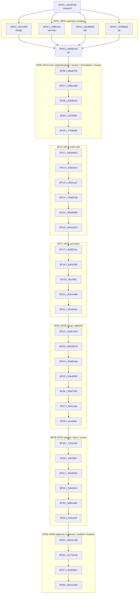

# Signet productionisation plan and executable acceptance matrix

This document is the canonical synthesis of SP00–SP04 for the `signet-productionization-20260717` campaign. It reconciles the upstream gap analysis, UX, security, runtime, and release contracts into one staged plan that the next implementation cards can follow without re-reading the full source set.

- Board: `kanban`
- Tenant: `signet-productionization-20260717`
- Synthesis card: `t_e800e416` (`qa`)
- Source branch at synthesis time: `sp02-security-contract`
- Safety defaults: no live credentials, no live sends, no Tailscale changes, no service installs, no Hermes route changes, no gateway restarts, and no secret values in docs/logs/artifacts.

## Product invariants carried forward

1. Reviewed low-risk leaf communication tools may use `approval_optimistic` only when the authoritative request is durably queued and the upstream-compatible success contract is captured after queueing; otherwise use transparent pending or a gateway-specific companion tool.
2. `virtualize_local` remains a separate bounded local-staging mode with no provider effect.
3. One user may enrol multiple independent named TOTP credentials and multiple named passkeys.
4. Each TOTP enrolment owns its own seed/record; do not clone one secret to multiple devices and call that multiple enrolments.
5. The end-user happy path is no harder than installing a package and running `signet setup`; no source checkout, no `uv`, no hand-edited YAML, and no copied bearer token.

## Source-card reconciliation

| Phase | Card | Assignee | Parents | Output |
| --- | --- | --- | --- | --- |
| SP00 | `t_c6c4b536` | research | `t_1bc40a96` | Repo-state and gap matrix for the current `main` branch and live release surface. |
| SP01 | `t_fb14cf0d` | design | `t_c6c4b536` | Zero-to-working install and resumable setup UX spec. |
| SP02 | `t_cfd6611b` | security | `t_c6c4b536` | Multi-passkey and multi-TOTP production security contract. |
| SP03 | `t_8dc69605` | ops | `t_c6c4b536` | Production runtime, services, storage, upgrades, and rollback contract. |
| SP04 | `t_c04906d3` | qa | `t_c6c4b536` | Packaging, release, compatibility, and clean-host acceptance contract. |
| SP05 | `t_e800e416` | qa | `t_fb14cf0d`, `t_cfd6611b`, `t_8dc69605`, `t_c04906d3` | This synthesis plan and executable acceptance matrix. |

The campaign graph is canonical: do not renumber, reword, or invent IDs.

## Current code reality

- `src/signet/policy.py`, `src/signet/operations.py`, `src/signet/state_machine.py`, `src/signet/migrations/0001_initial.sql`, `spec/policy-v1.yaml`, and `docs/policy-guide.md` currently model `deny`, `approval`, `passthrough`, and `virtualize_local`. `approval_optimistic` is a target compatibility requirement inherited from the upstream APG contract and should be treated as a schema-compatible success-contract wrapper, not as a provider-effecting path.
- `src/signet/totp.py::find_totp` and `SQLiteTotpCredentialRepository.replace_totp` still assume a single active TOTP per user.
- `src/signet/migrations/0002_persistent_auth.sql` still enforces `auth_credentials_one_active_totp`, so the database currently encodes the singleton TOTP assumption.
- `src/signet/webauthn.py::credentials_for_user` and `SQLiteWebAuthnRepository.replace_credential` already model multiple passkeys; that plural shape must be preserved.
- `src/signet/auth.py::complete_totp_login`, `complete_webauthn_login`, `revoke_user_sessions`, and `replace_password` already provide the durable session/proof path and must remain action-bound and single-use.
- `src/signet/web_backend.py::password_totp_login`, `begin_passkey_login`, `complete_passkey_login`, `begin_passkey_action`, `complete_passkey_action`, `complete_totp_action`, and `_revoke_preauth_session` are the primary browser/MCP entry points; keep them conservative and bound.
- `src/signet/models.py::PolicyMode` already separates `approval`, `passthrough`, and `virtualize_local`; do not collapse these into one mode.
- `src/signet/deployment.py` plus `docs/deployment.md` and `docs/production-runtime.md` define the current no-live/staged boundary.
- `pyproject.toml`, `.github/workflows/ci.yml`, and `.github/workflows/release.yml` define the build/test/release floor.

## Staged implementation plan

### Stage 0 — policy-contract compatibility and `virtualize_local` separation
Depends on SP00.

Files and symbols:
- `src/signet/policy.py`: `PolicyMode`, policy translation, and reviewed-tool contract capture.
- `src/signet/operations.py`: policy application and the tool mode map.
- `src/signet/state_machine.py`: request-state transitions and policy-mode validation.
- `src/signet/migrations/0001_initial.sql`: initial `policy_mode` enum constraint.
- `spec/policy-v1.yaml`: declarative policy contract fixture.
- `docs/policy-guide.md`: human-readable policy contract.
- `tests/test_spec_fixtures.py`, `tests/test_gateway.py`, `tests/test_mcp_mirror.py`, `tests/test_policy_persistence.py`, `tests/test_schema_registry.py`: policy-mode regression coverage.

Implementation notes:
- Preserve `approval_optimistic` as a compatibility contract for low-risk leaf tools; if exact output compatibility cannot be proven, prefer honest transparent pending or a companion tool.
- Keep `virtualize_local` separate and bounded to local staging with no provider effect.
- Do not merge policy modes just to simplify the runtime; the acceptance contract depends on the distinction.

Validation:
- `uv run pytest tests/test_spec_fixtures.py tests/test_gateway.py tests/test_mcp_mirror.py tests/test_policy_persistence.py tests/test_schema_registry.py -q`
- `git diff --check`

Rollback point:
- If the policy contract cannot be proven by tests, revert the policy/spec changes together and keep the existing no-live boundary intact.

### Stage 1 — factor contract convergence
Depends on SP00 and SP02.

Files and symbols:
- `src/signet/totp.py`: `TotpCredential`, `TotpCredentialRepository.find_totp`, `SQLiteTotpCredentialRepository.replace_totp`, `TotpVerifier.verify`, `PyotpTotpProvider.verify_step`.
- `src/signet/webauthn.py`: `WebAuthnCredential`, `WebAuthnRepository.credentials_for_user`, `SQLiteWebAuthnRepository.replace_credential`, `WebAuthnAssertionVerifier.verify`.
- `src/signet/auth.py`: `ApprovalConfirmation`, `complete_totp_login`, `complete_webauthn_login`, `revoke_user_sessions`, and the proof-claims helpers.
- `src/signet/models.py`: factor-related model fields and proof claims if labels or metadata need to be carried.
- `src/signet/migrations/0002_persistent_auth.sql`: replace the singleton `auth_credentials_one_active_totp` constraint with the new factor model and keep password uniqueness explicit.

Implementation notes:
- Keep TOTP and passkey material secret-free in logs and `repr`s.
- Add per-factor name/label, last-used, and revocation state without exposing secrets.
- Preserve action binding, replay prevention, and session rotation semantics.
- Keep last-factor and last-admin protections fail-closed.

Validation:
- `uv run pytest tests/test_auth_totp.py tests/test_auth_persistence.py tests/test_auth_webauthn.py tests/test_web_backend.py -q`
- `uv run pytest tests/test_integration_web_backend.py -q`
- `git diff --check`

Rollback point:
- Revert the migration and factor-model changes together if the plural-factor contract cannot be proven by tests.

### Stage 2 — install, setup, runtime, and operator UX
Depends on SP01 and SP03.

Files and symbols:
- `src/signet/deployment.py`: `DisabledDeploymentConfig`, `create_mcp_app`, `create_web_app`, `run_deployment_command`.
- `src/signet/web.py` and `src/signet/web_backend.py`: setup/login flows and on-device browser wizards.
- `deploy/launchd/render-disabled-plists.py`, `deploy/launchd/*.plist.example`.
- `deploy/hermes/configure-disabled-profile.py`, `deploy/hermes/configure-demo-profile.py`, `deploy/hermes/README.md`.
- `docs/deployment.md`, `docs/production-runtime.md`, `docs/operator-runbook.md`.
- `README.md` index entries.

Implementation notes:
- `signet setup` must remain resumable and must not duplicate principals, factors, routes, services, or secrets.
- Install/setup must not require source checkout or `uv` for end users.
- Production runtime remains separate from no-live staging until the later cutover ceremony is explicit and human-approved.
- Keep the private HTTPS/Tailscale URL discovery explicit.
- Keep `virtualize_local` isolated from provider effects.

Validation:
- `uv run pytest tests/test_deployment.py tests/test_launchd_render.py tests/test_operator_docs.py tests/test_backup.py -q`
- `uv run pytest tests/test_browser_e2e.py -q`
- `git diff --check`

Rollback point:
- Keep the inert templates and `DisabledDeploymentConfig` as the only default deployment path until live runtime work is separately reviewed.

### Stage 3 — packaging, release, and clean-host acceptance
Depends on SP04.

Files and symbols:
- `pyproject.toml`.
- `.github/workflows/ci.yml`.
- `.github/workflows/release.yml`.
- `README.md`.
- `docs/deployment.md`.
- `docs/production-runtime.md`.

Implementation notes:
- Keep the public artifact name `signet-gateway` and CLI `signet`.
- Ship platform-specific wheels for macOS arm64 and Linux x86_64; do not publish a universal wheel.
- Preserve Python 3.12.x and SQLite 3.51.3+ floors.
- Require GitHub release provenance, checksums, SBOM, Sigstore attestations, and PyPI trusted publishing for stable releases.
- No release can be called production-ready unless the clean-host matrix passes.

Validation:
- `uv lock --check`
- `uv run ruff check .`
- `uv run ruff format --check .`
- `uv run mypy`
- `uv run pytest -q --cov=signet --cov-report=term-missing --cov-fail-under=85`
- `uv build --no-sources`
- `git diff --check`

Rollback point:
- If a release gate fails, roll back the release workflow change or tag before any stable publish; do not weaken the provenance requirements.

## Normative acceptance matrix

| ID | Scenario | Evidence / commands | Pass condition |
| --- | --- | --- | --- |
| AC-00 | Policy-mode compatibility and `virtualize_local` separation | `uv run pytest tests/test_spec_fixtures.py tests/test_gateway.py tests/test_mcp_mirror.py tests/test_policy_persistence.py tests/test_schema_registry.py -q` | The upstream-compatible `approval_optimistic` contract is preserved at the policy boundary and `virtualize_local` still has no provider effect. |
| AC-01 | Multi-TOTP + multi-passkey enrollment / revoke / use | `uv run pytest tests/test_auth_totp.py tests/test_auth_persistence.py tests/test_auth_webauthn.py tests/test_web_backend.py -q` | Multiple named credentials per user work independently; revoking one does not break the others; last-factor protection is enforced. |
| AC-02 | Action-bound login and confirmation | `uv run pytest tests/test_auth_persistence.py tests/test_auth_totp.py tests/test_auth_webauthn.py -q` | A fresh proof cannot be replayed across actions, users, or factor types; session rotation remains atomic. |
| AC-03 | Setup / resume / operator UX | `uv run pytest tests/test_browser_e2e.py tests/test_deployment.py tests/test_operator_docs.py -q` | `signet setup` resumes cleanly; no source checkout or manual YAML is required; the private URL is shown explicitly. |
| AC-04 | Runtime, backup, rollback | `uv run pytest tests/test_backup.py tests/test_launchd_render.py tests/test_deployment.py -q` | No-live defaults remain intact; backup/restore and rollback semantics are documented and testable. |
| AC-05 | Release artifacts and provenance | Successful tagged `.github/workflows/release.yml` run for the exact main-branch commit; download the published release; verify `SHA256SUMS`, the CycloneDX SBOM root and dependency graph, Sigstore bundle identities, and GitHub build/SBOM attestations with `gh attestation verify`; inspect the PyPI publish provenance for the tag | Native Linux x86_64 and macOS arm64 wheels, sdist, checksums, and SBOM are present and verified; every artifact identity and attestation resolves to the tagged workflow; stable PyPI publish provenance names the configured trusted publisher and no API token. |
| AC-06 | Docs/link/format hygiene | `git diff --check` plus a local link/fence sanity script | README and new plan links resolve; markdown fences are balanced; no whitespace damage. |

## Acceptance gates by platform

- macOS arm64: `pipx install signet-gateway` or a signed installer, `signet setup`, launchd render/smoke, browser wizard.
- Linux x86_64: same install/setup path, service/lifecycle validation, and release artifact smoke.
- Python: 3.12.x only for supported runtime.
- SQLite: 3.51.3 or newer for supported runtime and tests.
- Releases: platform wheels plus source dist, checksums, SBOM, Sigstore attestations, and PyPI trusted publishing.

## Campaign graph reference

| Phase family | Card IDs | Owner class |
| --- | --- | --- |
| SP00–SP05 | `t_c6c4b536`, `t_fb14cf0d`, `t_cfd6611b`, `t_8dc69605`, `t_c04906d3`, `t_e800e416` | research / design / security / ops / qa |
| SP06–SP10 | `t_86aaf72b`, `t_048cca8d`, `t_f22b8443`, `t_2d75f65f`, `t_770360fb` | core implementation / review / remediation / merge |
| SP11–SP16 | `t_8a0debc0`, `t_e06cfac6`, `t_c3b21ea7`, `t_76d3310b`, `t_d8e08385`, `t_8d4cd313` | multi-auth |
| SP17–SP21 | `t_4e6507ec`, `t_6cb316f6`, `t_6fccf561`, `t_d547e490`, `t_fd143e2e` | providers |
| SP22–SP28 | `t_0a2b7033`, `t_68626075`, `t_d7e661bb`, `t_b2ed95f4`, `t_f0bb70b5`, `t_fbf41c6e`, `t_efca5fee` | setup / platform |
| SP29–SP34 | `t_722a10f4`, `t_06f1f9d7`, `t_28a3355c`, `t_f1be33c5`, `t_888cc8dc`, `t_22bcb1ff` | release / docs / review |
| SP35–SP38 | `t_88101458`, `t_b171622b`, `t_9c4b99e7`, `t_82e7a184` | dogfood / readiness / publish / finalizer |

## Mermaid dependency diagram

## Documentation pointers

- `docs/security-model.md` for the current security model.
- `docs/deployment.md` for the current no-live staging guide.
- `docs/production-runtime.md` for the target production lifecycle contract.
- `docs/operator-runbook.md` for the inert demo and recovery workflows.
- `docs/policy-guide.md` for the policy-mode contract that must continue to keep `virtualize_local` separate.

## Notes for the next implementer

- This plan is intentionally stage-only; do not claim live cutover, live sends, or production readiness from the docs work alone.
- Keep the current no-live staging surface stable while the later implementation cards land.
- If a future change needs to relax a safety boundary, it must be called out explicitly in a new review doc and backed by tests before any release work proceeds.
