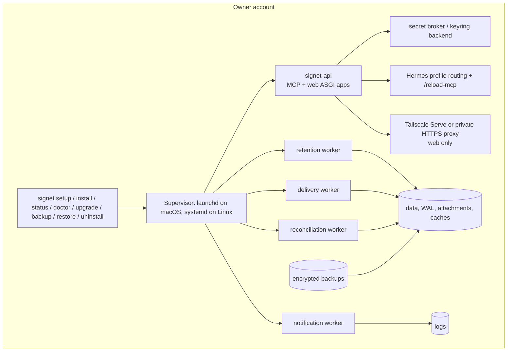
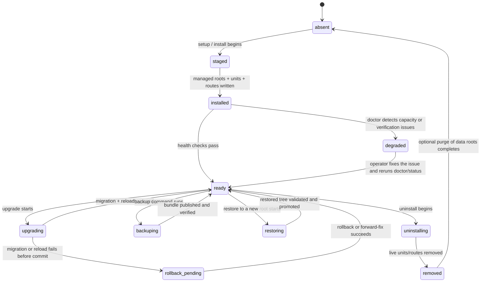

# Production runtime and lifecycle architecture

This document defines the target production runtime for a packaged Signet install on
supported macOS and Linux hosts. It complements `docs/deployment.md`, which remains
the current no-live staging and authorized-install guide in this repository.

The design goal is a packaged install that can be set up, inspected, upgraded,
backed up, restored, and uninstalled without requiring a source checkout or `uv`
from the end user. The production lifecycle must be idempotent, discovery-first,
and fail closed.

## Runtime topology



The MCP listener remains loopback-only. The human web app is also loopback-only at
the process level and is exposed remotely only through a private HTTPS front end
such as Tailscale Serve or a reviewed local reverse proxy. Funnel is never part of
the design.

## Process responsibilities

| Process | Responsibility | Notes |
|---|---|---|
| `signet-api` | Serve the MCP surface and the authenticated web UI | Contains no background queue scanning or cron-like work. |
| `delivery worker` | Perform the first downstream dispatch after approval | Uses the durable request ledger and request-scoped idempotency keys. |
| `reconciliation worker` | Read-only downstream outcome inspection and bounded re-dispatch decisions | Never invents a success result. |
| `retention worker` | Purge scheduling, backup pin coordination, log/data retention, low-disk cleanup | Owns retention state and fails closed on uncertain purge state. |
| `notification worker` | Browser push, expiry alerts, and daily digest delivery | Reads the outbox and never blocks the API. |
| `setup / install / upgrade / restore` | One-shot lifecycle orchestration | These are commands, not always-on daemons. |

Each worker is independently supervised. A failure in one worker must not stall the
others, and a reload of Hermes routes must not require killing the API unless the
reviewed change truly needs it.

## Lifecycle command contract

The user-facing production verbs are intentionally narrow and idempotent:

| Command | Primary job | Idempotency rule | Default side effects | Restart policy |
|---|---|---|---|---|
| `signet setup` | First-run bootstrap and conservative discovery | Re-running it must resume or report state; never duplicate principals, factors, routes, services, provider calls, or secrets | Create or merge managed roots, service units, route fragments, and storage roots | Prefer reload; restart only after separate approval |
| `signet install` | Apply one desired runtime state | Treat already-installed managed objects as a no-op when hashes match | Render or update managed config, unit files, and route fragments | Never restart by default |
| `signet status` | Read-only inventory snapshot | Purely observational | Show paths, owners, units, ports, routes, schema, health, and budgets | Never mutates |
| `signet doctor` | Read-only verification of the installed runtime | Purely observational | Run integrity, capacity, and backend checks | Never mutates |
| `signet upgrade` | Move to a newer release and schema | Must checkpoint and back up before any schema boundary | Stage new artifacts, migrate schema, restart Signet services, and reload routes | Supervised Signet restart is required; a Hermes gateway restart is a separate approval gate |
| `signet backup` | Create an encrypted bundle from a consistent snapshot | Re-running with the same output path must refuse to overwrite | Write one encrypted bundle to the backup root | No restart |
| `signet restore` | Restore a bundle into a new destination root | Never overwrite existing live state | Produce a new restored tree only | No restart |
| `signet uninstall` | Remove live service objects and routes | Re-running on an already-removed install is a no-op | Disable units, remove managed route fragments, keep backups by default | No restart |

The command handlers should discover and merge existing host state rather than reset
it. Existing ports, profiles, routes, and config fragments are inputs, not obstacles.
If a discovered object is not clearly Signet-owned, the command must report the
conflict and stop instead of silently taking it over.

### Discovery and merge rules

The commands above must use stable natural keys and an explicit ownership ledger:

- principals: exact namespace + human identity;
- authentication factors: user ID + factor label + factor type + credential ID;
- routes: profile + alias + path + port;
- service units: unit name + owner account + source hash;
- provider calls: request idempotency key + canonical payload hash;
- secrets: exact `keychain://service/account` reference;
- backups: bundle destination + bundle fingerprint;
- restore targets: destination root identity.

If a rerun encounters an existing object with the same ownership fingerprint, it must
reuse the object. If it encounters an object with the same name but a different
ownership fingerprint, it must report the conflict and stop unless an explicit adopt
flag is present.

## State model



`status` may be run in any state. `doctor` must fail closed when the state is
`degraded`, `rollback_pending`, or `restoring` unless the operator has intentionally
entered the matching repair flow.

## Platform matrix

| Host | Supervisor | Secret backend | Remote web exposure | Recommended deployment mode | Notes |
|---|---|---|---|---|---|
| macOS same-user | launchd user agent | login Keychain via `keyring` | Tailscale Serve or a private HTTPS proxy for the web listener only | Personal desktop | Easiest path, but not a defense against malicious same-user software. |
| macOS separate-user | launchd user agent under a dedicated account | that account's Keychain | Same as above | Stronger local boundary | Preferred when Signet secrets should not share a daily-use account. |
| Linux same-user | systemd user units | platform keyring backend, typically Secret Service | Tailscale Serve or private HTTPS proxy for the web listener only | Developer workstation | Must fail closed if no compatible keyring backend is present. |
| Linux separate-user | systemd user units under a dedicated account, or a system service that only launches that account's user manager | that account's keyring backend | Same as above | Server or multi-user host | Use a dedicated service account for the cleanest least-privilege boundary. |

In every row:

- the MCP listener is loopback-only;
- the web listener is loopback-only until a private HTTPS front end is explicitly
  configured;
- Funnel remains disabled;
- no secret values are stored in process arguments, unit environment variables, or
  profile files.

## Ownership and storage budget

The runtime must remain bounded on the internal SSD by default. The install should
warn before placing bulky state on the internal volume, and it must never silently
move data to an external drive.

| Path class | Default location | Ownership and mode | Default budget | Notes |
|---|---|---|---|---|
| Runtime root | account-local Signet service root | service account, private directory | small, mostly metadata | Managed fragments, state pointers, and service metadata live here. |
| SQLite database + WAL | `.../data` | service account, `0700` dir / `0600` files | hard cap: 1 GiB | Includes the live schema and write-ahead log. |
| Attachments | `.../data/attachments` | service account, `0700` dir / `0600` files | soft cap: 4 GiB, hard cap: 8 GiB | Attachments must be purged per retention rules. |
| Backups | `.../backups` | service account, `0700` dir / `0600` files | soft cap: 4 GiB, hard cap: 8 GiB on internal storage | External backup roots require an explicit verified path. |
| Logs | `.../logs` | service account, `0700` dir / `0600` files | 512 MiB total | Rotate at about 25 MiB per file with a small fixed generation count. |
| Browser assets and caches | `.../browser` and `.../cache` | service account, `0700` dir / `0600` files | 1 GiB total | Includes service-worker assets, icon cache, and optional browser test assets. |
| Installed code/runtime | release package root | read-only release ownership | bounded by release artifact size | Not counted against mutable data budgets. |

Low-disk policy:

- warn when free space drops below the larger of 4 GiB or 15% of the hosting volume;
- fail closed when there is not enough space for one more backup bundle, one more
  attachment growth batch, and the next log rotation;
- refuse to continue if the chosen data or backup root would exceed the configured
  budget after the next expected write;
- never move state to an external path without an explicit, verified operator
  choice.

`status` must report the canonical physical path, owner, mount identity, and current
usage for each managed root. `doctor` must additionally check that the roots are not
symlinks, that the owner matches the service account, that permissions are not
world-writable, and that the budget policy still leaves headroom.

## Secret broker and profile routing

- Configuration may contain only opaque secret references of the form
  `keychain://service/account`.
- The runtime resolves secrets at the narrow use site through the platform keyring.
  On macOS this is the login Keychain; on Linux the chosen keyring backend must be
  available and working or the install fails closed.
- `setup` and `doctor` should verify that every configured secret reference resolves
  successfully before services are marked ready.
- Hermes profile routes are managed as fragments, not by replacing unrelated profile
  content. A rerun must preserve any unrelated routes and only update the Signet
  owned fragment.
- Route changes should prefer Hermes `/reload-mcp`. A gateway restart is a separate
  explicit approval step and not the default outcome.
- Tailscale Serve may expose the web listener privately, but it must never be used to
  publish the MCP listener or to enable Funnel.

## Health, metrics, and logging

### Health

Health endpoints are intentionally shallow. They should answer whether the process is
alive and whether the current state is internally consistent, not whether the service
is safe for a live cutover.

Recommended signals:

- `status` summary: one-line live/blocked/degraded state with the unit names, ports,
  and route names;
- `doctor`: schema version, health of the secret backend, route ownership, disk
  budget headroom, and supervisor reachability;
- `/healthz`: loopback-only liveness probe for local supervisors.

### Metrics

Metrics and logs may expose only bounded counts, ages, durations, and state classes.
They must not expose payloads, tokens, full attachment names, raw provider results,
WebAuthn assertions, TOTP values, or key references.

Suggested metrics surface:

- queue depth by worker;
- last success time by worker;
- reconciliation attempt counts;
- pending/approved/failed request counts;
- free-space and budget headroom;
- schema version and migration lag;
- notification outbox depth and retry state.

### Logs

- keep separate logs per process or worker;
- rotate each log at a fixed size before the total log root grows without bound;
- redact request bodies and secrets at the source;
- prefer structured log records with request ID, worker name, and state class;
- do not log raw profile tokens, provider credentials, or full request payloads.

## Backup, restore, upgrade, and rollback boundaries

### Backup

A backup is an encrypted bundle created from a consistent SQLite snapshot plus the
attachment set and a manifest. The backup workflow must:

- use the SQLite backup API, not a file copy;
- acquire backup pins so retention cannot purge the snapshot mid-flight;
- write to a fresh destination path only;
- verify the bundle identity after publication;
- refuse a destination that already exists;
- stop at the configured size limit rather than emitting a partially trusted bundle.

### Restore

A restore must:

- extract into a new path that does not already exist;
- verify bundle authenticity before unpacking;
- verify the database integrity and foreign keys after unpacking;
- relocate attachment paths inside the new tree;
- never overwrite the only live copy;
- never restore over a newer live acknowledgement ledger if that would forget a
  caller-visible request.

A restored tree is not active until the operator intentionally promotes it.

### Upgrade

Upgrade proceeds in this order:

1. discover current state and hold the system in a quiescent or read-only posture;
2. create a backup;
3. stage the new release artifacts and service definitions;
4. run schema migrations if needed;
5. use the service manager to restart the Signet API and workers onto the staged
   release;
6. require every managed unit to be active and pass authenticated post-restart
   health checks, then re-run doctor;
7. refresh Hermes routes with `/reload-mcp` if the route surface changed;
8. only then ask for separate approval if a Hermes gateway restart is unavoidable.

If a Signet unit or post-restart check fails, the upgrade must not report success.
It must restore the prior artifacts and service definitions when that rollback is
provably safe. If a schema boundary or release bug makes rollback unsafe, the system
must stop in `rollback_pending` and require an operator decision to either repair
forward or restore from the just-taken backup.

### Rollback

Rollback is allowed only when the rollback boundary is provably safe.

Safe rollback cases:

- a service-unit or route-fragment change that has not yet produced a live provider
  mutation;
- a failed startup before any acknowledged request escaped the durable queue;
- a failed schema migration where the pre-migration backup is known to contain every
  caller-visible acknowledgement that matters.

Unsafe rollback cases:

- a live request was already acknowledged and could be forgotten by the older
  database;
- a downstream provider mutation already happened;
- the backup or restore path cannot be verified;
- a restart would be needed but has not been explicitly approved.

## Failure injection and validation

The production design should be testable with explicit failure injection at each
boundary.

| Injected failure | Expected result | Validation command |
|---|---|---|
| Missing keyring backend | `setup`/`doctor` fail closed before marking ready | `signet doctor` |
| Existing foreign port or route | discovery reports the conflict; install does not steal it | `signet install --dry-run` |
| Low disk headroom | `setup`, `upgrade`, and `backup` refuse to continue | `signet status`; `signet doctor` |
| Diverged managed fragment | rerun stops and shows the diff instead of overwriting unrelated content | `signet install` |
| Stale lock or concurrent run | the operation exits without damaging the active tree | `signet upgrade` |
| Hermes reload unavailable | the upgrade stops before a hard restart and asks for approval | `signet upgrade` |
| Tailscale Serve handler conflict | unrelated handlers remain unchanged | `tailscale serve status`; `signet status` |
| Restore target already exists | restore refuses to overwrite it | `signet restore` |
| Schema newer than runtime | doctor/status report incompatibility, but no mutation happens | `signet doctor` |

## Validation commands

These are the operator-facing checks that should validate a production install:

```console
signet status --json
signet doctor --json
signet setup --dry-run --data-root /ABSOLUTE/DATA/ROOT --backup-root /ABSOLUTE/BACKUP/ROOT
signet install --dry-run
signet backup --output /ABSOLUTE/BACKUP/ROOT/signet-YYYY-MM-DD.bak
signet restore --bundle /ABSOLUTE/BACKUP/ROOT/signet-YYYY-MM-DD.bak --destination /ABSOLUTE/RESTORE/ROOT
signet uninstall --dry-run
launchctl print gui/$(id -u)/ai.hermes.signet.mcp
systemctl --user status signet-api.service signet-delivery.service signet-reconciliation.service signet-retention.service signet-notification.service
curl http://127.0.0.1:8789/healthz
curl http://127.0.0.1:8790/healthz
tailscale serve status
```

During a live Hermes session, use `/reload-mcp` for route changes before considering
a restart.

Developer-side repository verification remains separate from the packaged runtime
contract and can continue to use the source tree's existing test suite.

## Current implementation anchors

The existing repository already provides most of the low-level primitives that this
production contract will orchestrate:

- `src/signet/runtime.py` assembles the loopback MCP runtime, host/origin checks, and
  request concurrency limits;
- `src/signet/web.py` assembles the authenticated web app;
- `src/signet/credential_broker.py` resolves keyring-backed secret references;
- `src/signet/db.py` handles strict SQLite initialization, WAL, schema checks, and
  snapshot creation;
- `src/signet/backup.py` creates and restores encrypted bundles;
- `src/signet/reconcile.py`, `src/signet/delivery.py`, `src/signet/retention.py`,
  and `src/signet/notification_outbox.py` provide the worker logic;
- `docs/deployment.md` and `docs/operator-runbook.md` already define the current
  no-live staging and review-only operator flows.

This document defines the target production lifecycle that future packaging and
orchestration work should satisfy without changing the repository's current no-live
stance.
